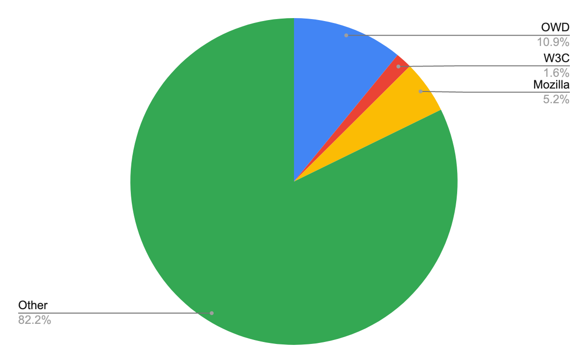
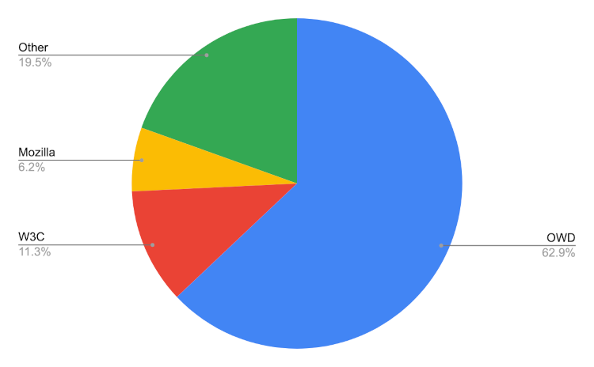

> In 2022 Q3, OWD:
> - was again the main organization maintaining the [mdn/content](https://github.com/mdn/content) repository:
>   - made 1,945 reviews for PRs merged into mdn/content, 63% of all reviews.
>   - made 284.5 of the PRs made to mdn/content, 11% of the total and twice as many as any other organization.
> - led projects to:
>   - update thousands of JS code samples in MDN to use modern practices.
>   - integrate markdownlint into the mdn/content repository.
>   - ensure MDN content and examples follow best practices.
> - launched a website at [https://openwebdocs.org](https://openwebdocs.org) and Carle, the book worm, the new OWD logo.

This report provides an update on Open Web Docs for Q3 2022. It’s split into the following parts:

1. [**Goals**](#goals): a restatement of the overall goals of the organization.
2. [**Impact**](#impact): a summary of day to day contributions to documentation projects.
3. [**Projects**](#projects): a summary of completed projects.

# Goals

Just like in 2021, the main focus of Open Web Docs in 2022 has been contributing to MDN Web Docs.

This takes the form of contributions to the main content repositories under the [https://github.com/mdn](https://github.com/mdn) GitHub organization:

* [mdn/content](https://github.com/mdn) : the main content repository for MDN Web Docs.
* [mdn/browser-compat-data](https://github.com/mdn) : the source of browser compatibility data.
* [mdn/learning-area](https://github.com/mdn) : examples supporting the MDN Learning Area.
* [mdn/interactive-examples](https://github.com/mdn) : source for MDN’s interactive examples.

# Impact

## The value of MDN

MDN is an essential resource for web developers. It:

* [has been cited from Stack Overflow more than 150,000 times in the last 5 years](https://meta.stackoverflow.com/questions/417189/which-sites-are-currently-linked-to-most-often-in-stack-overflow/417190#417190), #2 among all developer documentation sites.
* was ranked #2 (behind Stack Overflow) in the [State of JS 2021](https://2021.stateofjs.com/en-US/resources/#sites_courses), and [State of CSS 2021](https://2021.stateofcss.com/en-US/resources/#sites_courses) surveys.
* receives tens of millions of unique visitors every month.

It is therefore essential for the web developer community that MDN continues to be maintained and improved, and the core team continues to be supported in reviewing PRs from the contributor community.

## The contribution of Open Web Docs

Open Web Docs is the most significant organization contributing to MDN content maintenance. Of the multiple MDN organization repositories supported by Open Web Docs, the busiest is **mdn/content**, which contains the source for MDN’s pages. This repository is extremely active:

* mdn/content is the 5th most active repository on all of GitHub, as measured by the number of commits/month according to [https://git-pulse.github.io/snapshots/](https://git-pulse.github.io/snapshots/).
* In Q3 2022, 2,607 PRs were merged into mdn/content from 535 unique contributors.

This report will demonstrate OWD’s contribution to the day-to-day maintenance of mdn/content with two metrics:

* **Quarterly PRs merged to the mdn/content repository.**
* **Quarterly number of reviews performed on each merged PR to the mdn/content repository.**

Both these metrics contain contributions by OWD team members, other organizations that help maintain the repository, and volunteer contributors. Contribution metrics are divided into the following groups:

* OWD staff
* W3C staff (this is actually just Mike Smith)
* Mozilla staff
* Other (mostly volunteers, but also people paid by other organizations to work on MDN)

As [@queengooborg](https://github.com/queengooborg) works for both OWD and Mozilla, her contributions have been evenly split between each organization.

### PRs merged to mdn/content

<table>
  <tr valign="top">
   <td><strong>PRs merged</strong>
   </td>
   <td><code>All merged PRs: 2607</code> 
       <code>OWD: 284.5</code> 
       <code>W3C: 42</code> 
       <code>Mozilla: 136.5</code> 
       <code>Other: 2144</code> 
       
   </td>
  </tr>
</table>

This demonstrates how, of organizations contributing to mdn/content as measured by PR volume, OWD is the biggest contributor. It also shows that mdn/content gets a huge volume of contributions from volunteers: 82.2% of PRs in Q2 were “Other”, which is mostly volunteers.

### Reviews of mdn/content PRs

<table>
  <tr valign="top">
   <td><strong>Reviews on merged PRs</strong>
   </td>
   <td><code>All merged PRs: 3090</code> 
       <code>OWD: 1942</code> 
       <code>W3C: 349</code> 
       <code>Mozilla: 193</code> 
       <code>Other: 603</code> 
       
   </td>
  </tr>
</table>

The small OWD team provides the largest number of PR reviews to mdn/content, by a significant margin. OWD technical writers performed 63% of all reviews on merged PRs in the quarter.

# Projects

In the third quarter of 2022, OWD completed the projects listed below.

## Modernization of JavaScript docs

During the 2010s, JavaScript evolved substantially as a language. The MDN Web Docs JavaScript documentation dates back to ES3. The docs were completely revamped around 2015 (for ES6), however, since then the docs didn’t see a major update throughout. New features were documented and used latest best practices, but docs for older features mostly demonstrate best practices of the time.

MDN Web Docs' primary audience is web developers. We want to have examples that can be used in most professional projects. Not using ES6+ features in 2022 is problematic as:

* Modern JavaScript is now easier to read and write.
* Most projects use modern JavaScript or transpilers.
* Some patterns used in the 2000s are now considered anti-patterns to avoid.

**In Q3 2022, we agreed which modern JS features to use on MDN, then applied them to most of our static examples.**

We proceeded in three phases.

1. First, we drove an open discussion to define JS features that are in common use now. The discussion was vivid and civil and was noticed in the JS community. The newsletter “JS Weekly” had a mention about it in one of its episodes, and 19 people participated in the discussion with a total of 81 messages; much more than usual MDN discussions. In that discussion, a consensus was reached about which JS features to use. Examples are, among other things:
    - using `for…of` or `.forEach` instead of classic `for(;;)` structure,
    - `let` and `const` instead of `var`
    - template literals,
    - arrow functions

2. In the second phase, we applied what has been consensus to most static examples of MDN. _We created a community of contributors to help us_. With the help of XYZ contributors and XYZ PRs, we updated most static examples of MDN. We limited ourselves to the most common features, and this changed the way MDN examples are perceived: from old-style coding examples, they are now modern-style examples.
3. Finally, the third phase consisted of updating MDN's JS coding guidelines. We also worked by consensus between all maintainers of MDN and created a single PR with 298 comments. This allowed us to communicate the new style to most maintainers but also to be able to refer to agreed conventions when divergences occur.

MDN is so large that there is still a lot to do after this project. For now, we focused on static examples on MDN pages. MDN also has interactive examples and a corpus of external examples (js-examples, css-examples, dom-examples, …); these examples should also be updated to the new guidelines. We hope to do this in the future. Still, as this is a significant piece of work, we would like to group this with a few other modernization activities that are needed: we would like to lint these examples with ESlint (to detect errors), avoid outdated APIs (like using the Fetch API instead of XHR), as well as fix any accessibility and semantic issues. We think it is a good idea to triage these structural issues, drive discussions about best practices and then apply the changes to all MDN pages.

To sum up, we renovated all static examples of MDN. They use modern JS and can be more easily copied and pasted into real projects. They also teach better practices to developers. Working with the community on this project has been gratifying, and as it helped to finalize the whole project in a quarter when otherwise these mass-changes on thousands of MDN pages can take much longer.

## Linting Markdown

The migration of MDN pages to Markdown improved the quality of MDN pages and its maintainability. In comparison to HTML, Markdown is easier to read on GitHub and leads to simpler diffs when reviewing PRs. It is also a lot more concise and resulting in more homogeneity of the source of MDN documents.

This homogeneity allows for the building and use of linters that will enforce a better structural and typographic coherence.

In Q3 2022, we worked with the community to integrate the most common Markdown linter, Markdownlint, into the writing workflow. We were particularly cautious, as it is the first linter we added to the writing process. Tooling should help writers and first time contributors, not annoy them.

To simplify editing for writers, we want Markdownlint to autocorrect all what can be auto-corrected. That way, writers don't need to know all the details of using Markdown (like empty lines before lists) or of our writing guidelines (like using underscore for italics, and two stars for bold)

The challenge resides in integrating the linting with the two workflows:

* Editing using the GitHub UI.
* Editing locally and pushing the result via git.

When editing locally, most editors (like VSCode) warn writers when they make an error. When using the online GitHub UI, there is no indication when a contributor doesn't follow the Markdownlint rules unfortunately.

Our challenge was to find a solution for both ways.

To solve this, we needed three pieces:

1. A Markdownlint bot, running daily, which fixes Markdownlint errors automatically, or notifies about non-auto-fixable errors.
2. A test in the GitHub CI, flagging the errors in the PR, allowing writers to fix them manually if they want.
3. Markdownlint integration with Husky so each time a commit is created locally, auto-fixable errors can be fixed without contributors having to do anything.

We have a few future improvements to perform still: we want to add more rules, like preventing images without alt texts. In order to do so, we need to fix all the existing problems to make sure the current HEAD passes with zero errors, and then update our config files to enable the test.

Overall, Markdownlint integration went smoothly, to the point where the daily Markdownlint bot has very errors to catch. This improves the quality of the source of the docs, and we will be able to add more rules in the future.

## Best practices: emulate what we teach

As noted in the [value of MDN](#the-value-of-mdn), MDN is an essential resource for web developers, second only to stack overflow, and the second most important resource for stack overflow. A large percentage of Stack Overflow answers are code snippets copied directly from MDN. MDN is itself a learning resource for new and senior developers alike. For these reasons, and more, it’s important that all examples demonstrate accessible semantic best practices.

To this end, several objectives to reach this best practices goal, including (but not limited to).

* Ensuring `<html>` elements are preceded by a doctype.
* Ensuring `<html>` elements include a lang attribute
* Including a  charset `<meta>` tag in all full header examples
* Including the viewport `<meta>` tag in all full header examples
* Ensure the `<abbr>` element is used correctly, removing the title attribute from the majority of occurrences.
* Ensuring any included `<b>` and `<i>` elements are solely presentational in nature.
* Removed browser prefixes from supported CSS properties; updating all examples that included prefixes.
* Removed unnecessary type attributes, such as `type=”text/css”` and `type=”text/javascript”`.
* Removed most references to HTML5 and CSS3, as both HTML and CSS are living standards without version numbers

Work is ongoing to ensure `<input>` examples that contain more than just the `type` attribute include recommended attributes, such as name and value on checkboxes, radio buttons, and hidden inputs and ensure examples that contain form controls have a label associated with the form control.

At the beginning of the quarter, there were 404 empty alt attributes in markdown code, and over 100 images with either the name of the image as the alt attribute value or missing alt attributes in an HTML `` code block. Open Web Docs crowd sourced fixing over 500 alt attributes. At the end of the quarter, there are less than 125 left.

While working on the best practices goal, a lot of outdated content was discovered and updated. Many instances for  “when supported” and “new to the browser” language were deleted, and the surrounding content updated to remove any ‘experimental’ feel of well supported features.
