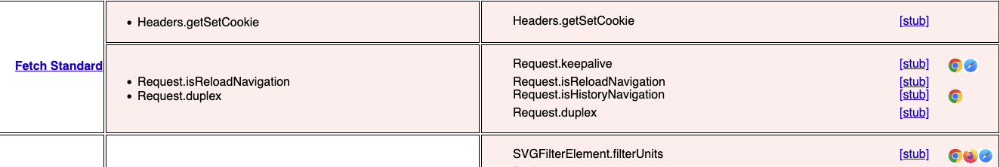
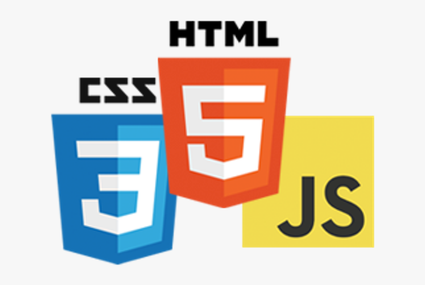

[MDN Web Docs](https://developer.mozilla.org/) is an invaluable information set about the web platform. With about 12,000 pages, it is the most extensive corpus of documents that web developers can rely on when creating websites.

Unfortunately, despite being almost 20 years old, many reference pages still need to be added. We call these missing pages _gaps_, and even have tools to detect some of them:

- Mozilla's [Yari](https://github.com/mdn/yari/) renderer logs missing pages as flaws when it builds a page.
- [Dominique Hazaël-Massieux](https://www.w3.org/People/Dom/), of the [W3C](https://www.w3.org/), created the [mdn-gaps](https://dontcallmedom.github.io/mdn-gaps/) tool which lists all specification features with missing reference documentation. 

These tools enable us to identify missing content and understand the extent of the issue.

## Why are there gaps on MDN?

Missing pages or gaps slipped in and their number grew organically. Initially, most MDN writers put great effort into documenting Firefox technologies like XUL and XBL, and time was scarce to focus on standardized languages. While CSS, HTML, and JavaScript were well documented, originally the docs for Web APIs were an afterthought. They lived under a DOM hierarchy on MDN. With the advent of HTML as a living standard and CSS module structure initiatives (and later ECMAScript 6), Mozilla Developer Network's focus shifted more from documenting proprietary to document open and interoperable technologies. The shift was progressive, culminating in rebranding the site as _MDN Web Docs_, the archiving of XUL and XBL docs, and, later, the moving of [Firefox Dev Tools](https://firefox-source-docs.mozilla.org/) documentation to a dedicated website.

Since the early 2010s (and even prior), standard bodies and browser makers have rapidly specified and implemented new APIs. MDN's goal was to document these new features. As these features were web developers' main focus, extensive, accurate, and current documentation was (and continues to be) required. The originally named "HTML5", "CSS3", and "ES6" initiatives allowed MDN to revamp these areas of documentation because there was an interest in positioning the web as a recognized interoperable and modern platform.

For the MDN writing community, the development of the web platform at larger speed led to being unable to keep up with documenting all new features while also trying to document the existing foundation of the web platform. This sometimes lead to mitigating actions, like listing methods and properties on the interface page but not creating the sub pages.

Today's gaps mostly fall into three categories:

- HTML DOM, and the SVG DOM features added to the web platform when MDN was still in its infancy;
- non-interoperable features: APIs supported by only one or two browser engines;
- single properties and methods that were forgotten when the interface was initially documented or added later.

## Opportunities created by the Interop initiative

As a collective of writers dedicated to documenting the open web platform, [Open Web Docs (OWD)](https://openwebdocs.org/) is able to _close these gaps_.  We believe that projects like this can significantly improve in the middle- and long-term health and the longevity of the documentation. We aim to provide complete documentation of the web platform.

For several years now, browser makers have come together to discuss the pain points of web developers and define the set of features that need more attention to improve their cross-browser functionality and to fix inconsistencies and issues ensuring web devs can implement them reliably. They define areas to focus on as part of the [Interop](https://web.dev/interop-2023/) initiative.

Within OWD's Steering Committee, we have determined that these projects are good opportunities to revisit the relevant area of the MDN Web Docs documentation. The idea is to have the docs in good shape for each set of features made interoperable over the year. Most of the time, this leads to minor changes to the docs. MDN writers tried to describe the interoperable behaviour, such as only mentioning browsers when their implementations diverged.

One of the Interop focus areas this year, [interop-2023-forms](https://wpt.fyi/results/?label=master&label=experimental&product=chrome&product=firefox&product=safari&aligned&view=interop&q=label%3Ainterop-2022-forms%20or%20label%3Ainterop-2023-forms), is to make HTML forms interoperable. It is a great opportunity to fill some of MDN's gaps. We decided to do the following:

1. Document all interoperable APIs unrelated to HTML and SVG.
2. Document all interoperable HTML APIs not part of the DOM (that is, everything in the HTML spec that is not an `HTML*Element` property or method).
3. Finally, document all missing HTML*Element features related to `<form>` (For example, `HTMLSelectElement`, `HTMLInputElement`, and `HTMLButtonElement` properties and methods).

The two first points let us detect any newly interoperable property or method and document it if no one else has already done so. For example, we found gaps after the launch of Safari 16.4 (like [`WritableStreamDefaultController.signal`](https://developer.mozilla.org/en-US/docs/Web/API/WritableStreamDefaultController/signal)). These two initial steps will enable us to maintain the completeness of our API reference for interoperable features (once we finish documenting the backlog).

The third step will give us a complete reference for the Forms APIs. It will be synchronized with this year's Interop initiative, where all three engines will be interoperable, fully supporting the Forms APIs.

## Current progress

During the first Quarter of 2023, we focused on the first point, documenting all interoperable APIs outside of the HTML and SVG APIs (See our [tracking project](https://github.com/openwebdocs/project/issues/152)). We added more than 100 pages to MDN, documenting missing modern features like [`CSSLayerBlockRule`](https://developer.mozilla.org/en-US/docs/Web/API/CSSLayerBlockRule) and [`CSSLayerStatementRule`](https://developer.mozilla.org/en-US/docs/Web/API/CSSLayerStatementRule), or old features writers forgot over the years, like [`XMLHttpRequestUpload`](https://developer.mozilla.org/en-US/docs/Web/API/XMLHttpRequestUpload).

Already we can detect missed interoperable APIs, unrelated to HTML and SVG DOMs, features that become interoperative: for example, we added the [`CSSFontFeaturesValuesRule`](https://developer.mozilla.org/en-US/docs/Web/API/CSSFontFeatureValuesRule) that received support in all major browsers in Q1.

In Q2, we are documenting HTML APIs that are part of the HTML DOM, interfaces like `ErrorEvent`, `HTMLAllCollection`, or even `HTMLOptionsCollection`. You can follow our progress in our [GitHub tracking issue](https://github.com/openwebdocs/project/issues/153). In the future, writers will link to these documents. New pages will not have _red links_, links to non-existent pages, improving the quality of our new documentation. The _Constraint Validation API_ documentation will also be improved this Quarter.

Then, in Q3, we plan to tackle the last point, the missing `HTML*Element` features related to forms. Overall we plan to add 350 pages this year, about 30% of the overall gaps (for interoperable features).

## And all the rest?

After this interop documentation project is complete, almost 700 more interoperable properties and methods will still need to be documented. We are developing plans to tackle the remaining gaps.

SVG documentation could benefit from a similar interop approach. In the first phase, we would like to document fundamental interfaces, like the types: `SVGLength`, `SVGAnimatedLength`. We want to call the community for help in the second phase: there are a lot of similar docs to write, like the multitude of SVG filters. Pages with similar structures, though with different examples, are a great opportunity for community involvement. 

We will see what will happen, and hopefully, we can report back on progress here!
