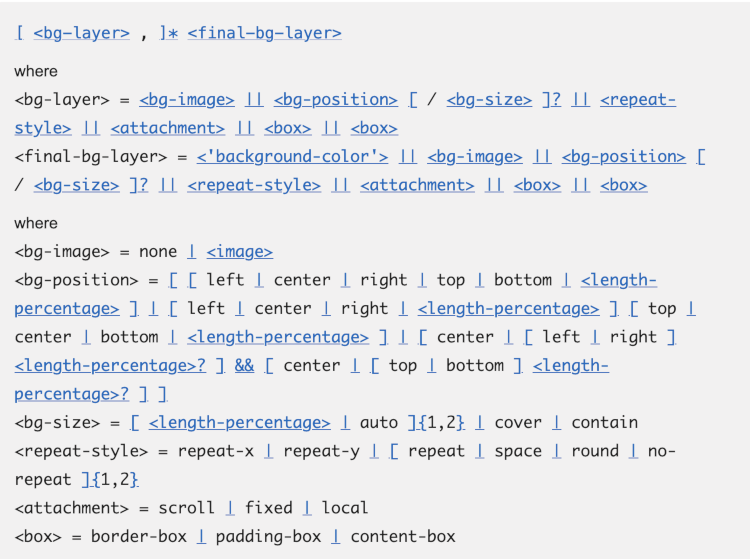

If you've spent much time with our CSS docs, you've probably seen the "Formal syntax" section in the CSS property reference pages. When we ask developers what they think of this part of the docs, most of them say something like "I have no idea what this means". This used to be my reaction too, but now I think it can be extremely useful. CSS properties can have very complex syntax, and explaining it in prose can be really hard. Once you've learned a few rules, the formal syntax gives you a very precise description of the syntax in a very concise manner.

Until recently, though, there were two big problems with the way we represented formal syntax.

The first problem was presentation: the macro that rendered the formal syntax as HTML tended to render it as a wall of text, making it hard to read and scarier than strictly necessary:

The second problem was about data quality. Although the formal syntax should match the syntax in the specifications, we maintained our own copy of the data in a separate repository, [mdn/data](https://github.com/mdn/data). We often weren’t able to keep this up to date with the specification, and as a result, users of MDN would see inaccurate or outdated syntax.

## Enter css-tree and @webref/css

Our solution to these problems rested heavily on two amazing open source packages.

The [css-tree](https://www.npmjs.com/package/css-tree) package enabled us to generate an [AST](https://en.wikipedia.org/wiki/Abstract_syntax_tree) for a formal syntax definition, making it much easier to render it in a more usable form. In particular, we have added syntax highlighting and pretty-printing. Here’s that syntax for `background` with the updated code:

Next, we replaced mdn/data as a data source with the [@webref/css](https://www.npmjs.com/package/@webref/css) package, developed and maintained by our friends at the W3C. This scrapes the syntax directly from the specifications, so we know it will be fresh.

The collection of webref packages contains lots of interesting structured content extracted from the specs, and we think there are [potentially many ways we can use it to make MDN more accurate and maintainable](https://github.com/mdn/yari/pull/7227#issuecomment-1264230886). Using it for formal syntax is, we hope, only the start.

## Wrapping up

Huge thanks go to [@lahmatiy](https://github.com/lahmatiy), the developer of css-tree, and [@tidoust](https://github.com/tidoust) for his work on webref and his patient guidance in navigating the CSS specifications.

We're interested to hear what you think too. If you have ideas for how we can make the formal syntax more useful and approachable, or how we can use structured content from the specs to improve MDN, please [let us know](https://github.com/openwebdocs/project/issues)!
