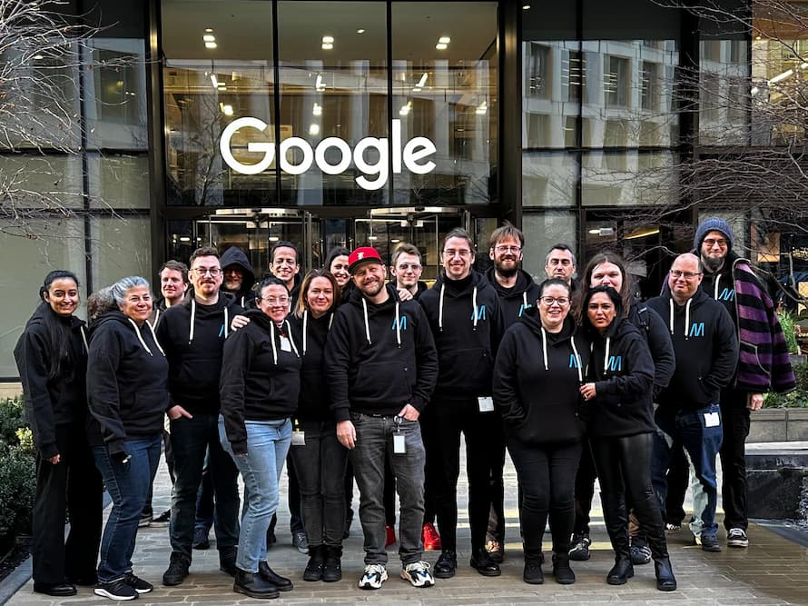

On January 18-20 all of the Open Web Docs Technical Writing team and members of the OWD Governing Committee were invited to London to meet with Mozilla’s MDN Team. Mozilla kindly sponsored our travel and accommodation and Google hosted all of us in their London office. We are very grateful for this opportunity. It was the first time we met as a group in person given Open Web Docs was founded during the global covid pandemic. Some of us met for the first time in real life.

For Open Web Docs, the most important project we contribute to is MDN Web Docs. We work closely with Mozilla, our main sponsors Google, Microsoft, Igalia, JetBrains, Canva, our 150+ individual funders, and the larger web community to maintain and innovate on the best documentation site for web developers and designers world wide.

At the end of last year, we started to work more closely with Mozilla than ever before to help with community coordination and to keep the MDN contribution process running efficiently. To that end, Mozilla and OWD also created a [shared and open roadmap](https://github.com/orgs/mdn/projects/26/) for ongoing and planned work. The Open Web Docs team is the largest group of people that contributes to MDN projects (mainly content and BCD) with the highest number of contributions and we are happy to collaborate and give direct input on MDN’s information architecture, compatibility data, content structures, code examples, and other changes coming up across the whole site.

With well over 10,000 pages on MDN and an ever evolving Web platform to document, the scope, requirements, and the impact of changes for web developers all around the world can be quite a challenge to get right. With all of the expertise from the different organizations, we all come together on MDN Web Docs to provide web developers with information they need to create amazing web pages and applications. It is this mission that drives all of us to collaborate closely, share knowledge, and bring new ideas to the table.

Our shared roadmap introduces a new tool that will help us to capture significant site changes, from content updates to navigation improvements, and will empower Mozilla, OWD, and our community to implement and execute complex projects together.

Many of the discussions in London were about how to collaborate more closely. We also had a few technical deep dive sessions where we were able to discuss in person some of the current projects we are working on. The minutes for these sessions are [available on our GitHub](https://github.com/openwebdocs/project/blob/main/steering-committee/meetups/london-2023/index.md). The topics were:

* [Content lifecycle](https://github.com/openwebdocs/project/blob/main/steering-committee/meetups/london-2023/session-content.md): We identified the maintenance cost of content additions during planning, defined sunsetting strategies, and discussed ways to separate technical or implementation details from prose that may quickly become outdated.
* [Information architecture / page types](https://github.com/openwebdocs/project/blob/main/steering-committee/meetups/london-2023/session-ia.md): We talked through the ongoing work to categorize and organize content on the site based on the type of technology it relates to, and how it works with other technologies.
* [Discoverability](https://github.com/openwebdocs/project/blob/main/steering-committee/meetups/london-2023/session-discover.md): We discussed how to make it simple for developers to find the information they need while browsing the site, improving the site's search functionality and making it more straightforward and exciting to discover new and related content.
* [Web platform feature groups](https://github.com/openwebdocs/project/blob/main/steering-committee/meetups/london-2023/session-webplatform.md): This discussion was about developing a hierarchy that groups platform features across technologies so that developers get a clear picture of whether they can use the features, what they relate to, and the browser and device support for these features.
* [Code examples](https://github.com/openwebdocs/project/blob/main/steering-committee/meetups/london-2023/session-code-examples.md): This session covered the plans to make the different types of code examples displayed on MDN easier to maintain and contribute to and ways to simplify the editor that renders them on the page for readers.
* [BCD](https://github.com/openwebdocs/project/blob/main/steering-committee/meetups/london-2023/session-bcd.md) (the meeting notes are thin, sorry): This session was about the state of the compatibility data, how to maintain it going forward, and how to guarantee data quality.

Having a meetup with Mozilla, W3C, Google, and Microsoft was an excellent opportunity to discuss ongoing efforts to support web platform documentation for the benefit of web developers & designers worldwide. Our community of technical writers, developers, standards makers, and technology companies continues to do invaluable work for MDN Web Docs. We aim to continue to support documentation as critical digital infrastructure for everyone.

If the overall situation allows, we would like to meet up in person again with our partners and people who deeply care about web infrastructure and documentation. Thanks again to Mozilla and Google for sponsoring us this time! If you want to sponsor Open Web Docs’ next meetup, or want to support us in some other way, get in touch: [florian@openwebdocs.org](mailto:florian@openwebdocs.org) or [jory@openwebdocs.org](mailto:jory@openwebdocs.org).

