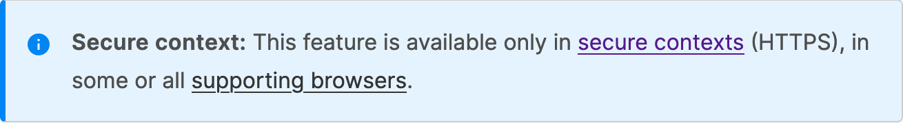

In this post we'll look at an investigation into the possibility of using data extracted from the W3C specifications to help make MDN more consistent, reliable, and maintainable. We're not yet sure where this idea will end up, but we hope the post gives an insight into how we evaluate large-scale changes to such an extensive documentation set. As always, the devil is in the details!

## Web IDL and the MDN Web/API documentation

The biggest single piece of MDN, accounting for about half the total number of pages, is [Web/API](https://developer.mozilla.org/en-US/docs/Web/API), which consists of reference documentation for the JavaScript APIs that are implemented in browsers. These features are defined, of course, in specifications, and the specifications use a language called [Web IDL](https://webidl.spec.whatwg.org/) to describe precisely what each API looks like. For example, here's the Web IDL for the [`PushSubscription`](https://w3c.github.io/push-api/#pushsubscription-interface) interface:

```
[Exposed=(Window,Worker), SecureContext]
interface PushSubscription {
  readonly attribute USVString endpoint;
  readonly attribute EpochTimeStamp? expirationTime;
  [SameObject] readonly attribute PushSubscriptionOptions options;
  ArrayBuffer? getKey(PushEncryptionKeyName name);
  Promise<boolean> unsubscribe();

  PushSubscriptionJSON toJSON();
};
```

There's a lot of information in the IDL that maps to the reference documentation on MDN, including, for example:

- the name of methods and properties belonging to an interface
- the names and types of parameters
- whether parameters are optional
- whether properties are read-only

At the moment, this mapping is maintained entirely manually: MDN authors have to check the IDL when writing a page, and reviewers have to manually check PRs against it. Moreover, we have no systematic way to update MDN when the specifications are changed or extended.

At Open Web Docs, we're interested in using and developing tools to reduce the maintenance cost of documentation while improving its consistency and reliability. So we recently spent a bit of time looking into one feature of the Web IDL, the [`SecureContext` extended attribute](https://webidl.spec.whatwg.org/#SecureContext), to see if we could use it in MDN.

## Secure contexts

Many web platform features are only available in secure contexts. This usually means that the script's document was served over HTTPS (but browsers also treat URLs like `localhost` as secure contexts, to make local testing more convenient).

When a feature is only available in secure contexts, MDN authors indicate this using macros in the Markdown source: the [secureContext_header](https://github.com/mdn/yari/blob/main/kumascript/macros/secureContext_header.ejs) macro adds a banner across the rendered page. So if an author includes a line like `{{secureContext_header}}`, then the rendered page will contain a box like this:



But this is maintained entirely manually, for all the thousands of web platform features that require a secure context.

Meanwhile, the specifications record "secure context required" using a Web IDL attribute `SecureContext`:

```
partial interface mixin WindowOrWorkerGlobalScope {
  [SecureContext, SameObject] readonly attribute CacheStorage caches;
};
```

What if we could use the Web IDL definitions to add the "secure context required" box to pages automatically?

## The analysis

We wanted to see if we would be able to map from features identified in the Web IDL to MDN pages, and how often we would encounter discrepancies between the IDL's `SecureContext` attribute and the presence or absence of the macro in the corresponding MDN pages.

We wrote a tool that sorted features defined in the Web IDL - interfaces, properties, methods, or events - into two groups: those that require a secure context and those that do not. Then we did the same for MDN pages for Web/API features that contained the `secureContext_header` macro, and those that did not. We then made three lists of anomalies:

1. Items whose MDN pages contained the `secureContext_header` macro, but which were not marked `SecureContext` in the Web IDL.
2. Items marked as `SecureContext` in the Web IDL, but whose corresponding MDN pages did not contain the `secureContext_header` macro.
3. Items whose MDN pages contained the `secureContext_header` macro, but which did not have a corresponding entry in the Web IDL.

For the first two of these, using Web IDL as the source of truth would change the MDN pages. We would like to know: would this change be for the better, or for the worse?

For the third, we would not be able to update these pages at all from Web IDL. What would we like to happen in these cases?

### Secure context in MDN, not secure context in Web IDL

This lists all features that are marked secure context in MDN, and not marked secure context in Web IDL (but do exist in Web IDL). If we just use Web IDL as the source of truth, then these MDN pages would no longer mark the features as secure context.

We found 61 items in this category. Most of these are cases where a feature _effectively_ requires a secure context, although it is not marked as such in the spec. For example:

- The [`getCurrentPosition()`](https://developer.mozilla.org/en-US/docs/Web/API/Geolocation/getCurrentPosition) method of [`Geolocation`](https://developer.mozilla.org/en-US/docs/Web/API/Geolocation) is not marked as requiring a secure context, but the implementation of the method requires constructing a [`GeolocationPosition`](https://developer.mozilla.org/en-US/docs/Web/API/GeolocationPosition) object, and that _does_ require a secure context. So MDN marks `getCurrentPosition()` as requiring secure context.

- The [`Notification`](https://developer.mozilla.org/en-US/docs/Web/API/Notification) interface is not marked secure context, but it is defined as a [powerful feature](https://notifications.spec.whatwg.org/#permissions-integration) requiring permission, and [getting permission itself requires a secure context](https://w3c.github.io/permissions/#dfn-getting-the-current-permission-state). So, again, MDN marks `Notification` as requiring secure context.

In cases like this, it seems like the docs would be worse if we used Web IDL as the source of truth.

### Secure context in Web IDL, not secure context in MDN

This lists the other direction: features that exist in both MDN and Web IDL, that are listed as secure context in Web IDL but not in MDN. If we just use Web IDL as the source of truth, then these MDN pages would start to mark the features as secure context.

We found 668 items in this category! We haven't looked at all of them, but in all the cases we have looked at, this is an error in MDN. A common source of this issue is when the interface is marked as requiring a secure context, which means all its members require secure context. Often in cases like this MDN will only mark the interface page as requiring secure context, and not the method or property pages.

So for this direction, using Web IDL as the source of truth would fix hundreds of MDN pages.

### Secure context in MDN, nonexistent in Web IDL

In this category we have features that are documented on MDN, but that don't have corresponding items in Web IDL at all. If we use Web IDL as the source of truth, what can we say about features that don't exist in Web IDL?

There are 38 pages in this category. They fall into two types: nonstandard features, and places where MDN does not directly represent IDL structures.

### Nonstandard features

In our study, almost all of these are features that used to be standard but were then deprecated and removed from the specification: for example, [`PaymentAddress`](https://developer.mozilla.org/en-US/docs/Web/API/PaymentAddress). Perhaps it's not so important to display secure context information for these.

However, nonstandard features are generally a problem for any broader attempt to use Web IDL as a data source. It's been suggested that we could extract the browser-specific IDL and make a nonstandard companion to the webref/idl package.

### Mapping discrepancies between Web IDL and MDN

MDN does not always directly document Web IDL structures, and this is generally a deliberate choice based on the belief that different structures serve MDN's audience better.

One example of this is mixin interfaces. In Web IDL, specification authors can define members - attributes and methods - on a mixin interface, which can then be added to one or more interfaces. For example, the [`Body`](https://fetch.spec.whatwg.org/#body) mixin is included by both the [`Request`](https://developer.mozilla.org/en-US/docs/Web/API/Request) and [`Response`](https://developer.mozilla.org/en-US/docs/Web/API/Response) interfaces.

Mixin interfaces aren't visible to web developers as a separate thing, though: they are a convenience for specification authors. [As the specification says](https://webidl.spec.whatwg.org/#idl-interface-mixins):

> Interface mixins, much like partial interfaces, are intended for use as a specification editorial aide, allowing a coherent set of functionalities to be grouped together, and included in multiple interfaces, possibly across documents. They are not meant to be exposed through language bindings.

So MDN doesn't model mixins, preferring to duplicate the mixed-in members in all the concrete interfaces that include them. We think this is a good choice for MDN, but it means we have to transform Web IDL before we can map it to MDN pages.

When MDN is consistent about divergences like this, and the rules are clear, then we can perform these transformations and successfully map from Web IDL to MDN. But sometimes MDN is not consistent. For example, Web IDL includes an [`iterable`](https://webidl.spec.whatwg.org/#dfn-iterable-declaration) declaration that can be applied to any interface. This effectively means the interface will have the members required by an iterable, such as [`entries()`](https://developer.mozilla.org/en-US/docs/Web/JavaScript/Reference/Global_Objects/Array/entries), [`forEach()`](https://developer.mozilla.org/en-US/docs/Web/JavaScript/Reference/Global_Objects/Array/forEach), [`keys()`](https://developer.mozilla.org/en-US/docs/Web/JavaScript/Reference/Global_Objects/Array/keys), and [`values()`](https://developer.mozilla.org/en-US/docs/Web/JavaScript/Reference/Global_Objects/Array/values).

When an interface is declared `iterable`, should MDN have separate pages for each of these methods, as it does for `Array`? Or should it just indicate that the interface is iterable, and link to the `Array` pages for the details?

In practice, different authors documenting different interfaces have made different choices here. And without consistency, we can't reliably map from Web IDL to MDN pages.

We've outlined a project to take care of these discrepancies, but it will take a while to resolve: https://github.com/openwebdocs/project/issues/159.

## What's next?

This story doesn't have a neat ending yet. There's definitely scope to use Web IDL in MDN pages. Already one of the most prolific volunteer contributors to MDN, [Onkar Ruikar](https://github.com/OnkarRuikar), has used this analysis to [add the secure context macro to all the MDN pages matching our second list of discrepancies, where the Web IDL marked the corresponding feature as needing a secure context](https://github.com/mdn/content/pull/32085).

We're pretty sure there are more ways we can use Web IDL, both for secure context and for other aspects of the docs. As this analysis shows, there are challenges too, some of which we know how to resolve and some we don't, yet.

We hope this post has given some insight into how we assess and plan systemic changes to the docs. And we hope that as we work through the issues we'll be able to make more use of Web IDL in MDN, making the docs more consistent, reliable, and maintainable.
