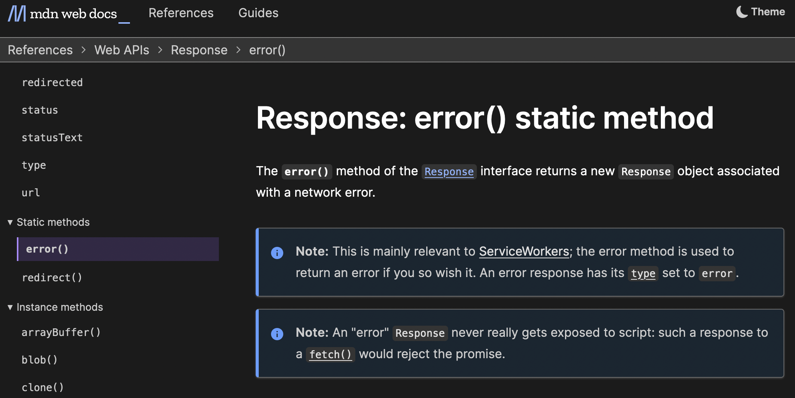

Some projects get to 80% and then take ages to get to "finished", but others take years to get going and then finish in a rush. Our project to retitle pages in MDN's [Web/API](https://developer.mozilla.org/en-US/docs/Web/API) documentation was the second kind.

The Web/API documentation is the biggest part of MDN, comprising about 6000 pages, a little over half the total. We think it's especially important, as it is the only place that offers a one-stop reference for web developers of all (or nearly all) the JavaScript APIs implemented by browsers.

It includes pages for every method and every property of an interface. The titles of these pages were in the format `InterfaceName.methodName()`:

[For a long time](https://discourse.mozilla.org/t/incorrect-titles-for-method-property-articles/31641), people have raised the issue that this is problematic, because it suggests that something like `Document.querySelector()` is valid code, which it isn't, of course.

The [last time this issue was raised](https://github.com/orgs/mdn/discussions/248), discussion eventually led, almost 2 years ago, to [a proposal for new page titles that was acceptable to everyone](https://github.com/orgs/mdn/discussions/248#discussioncomment-785747).

Finally, last week, we retitled all property, method, constructor, and event pages according to the proposal.

## The new titles

The new page titles are longer than the old ones, and are more descriptive of the sort of item being documented:

For the first time, MDN has different titles for static members in Web/API:

This is increasingly important now that we are seeing static and instance members of Web/API interfaces [with the same names](https://github.com/whatwg/fetch/pull/1392).

## Page titles and page types

This was one of those projects where a major component was consensus-building - making sure all the stakeholders were happy with the new title formats. After that, applying all the titles was "just mechanical". But in reality, the Web/API doc set is so big that retitling all the pages only became practical after we'd put in some infrastructure work.

This work is the ["page types"](https://github.com/openwebdocs/project/issues/91) project, in which we've defined a set of "types of things" that MDN's pages cover: for example, CSS property pages, or JavaScript global object pages, or HTML element pages. We then define a front matter key `"page-type"` whose value represents this type.

With that in place we have a reliable machine-readable way to figure out the kind of thing a page documents, and this enabled us to automate the retitling of about 4000 pages in a couple of days.

Page types don't just make our lives easier, though: we think they will enable other use cases in the future. For example, we'll be able to check that particular types of pages include particular content: for example, that every "CSS shorthand property" page includes a [section listing all its longhand properties](https://developer.mozilla.org/en-US/docs/Web/CSS/animation#constituent_properties). Then anyone will be able to query [mdn/content](https://github.com/mdn/content) to get a complete list of all shorthand properties and their longhands.

It will take us a while to get there, but step by step, we are getting towards a consistent, reliable, structured organization for MDN's reference documentation.
