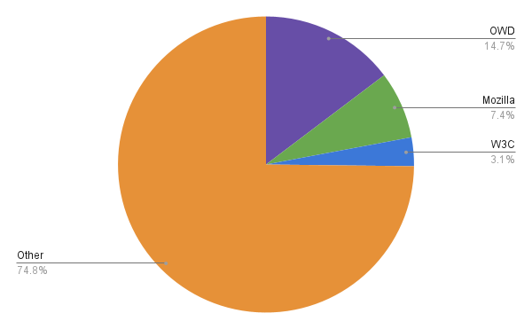
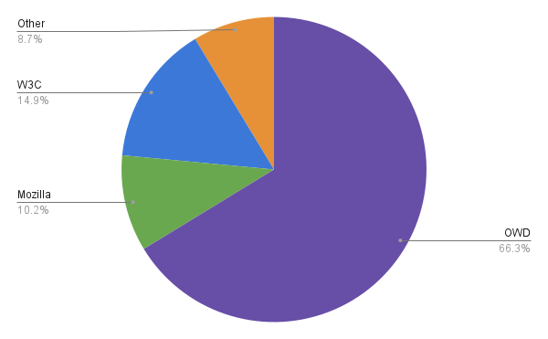
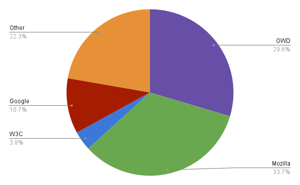
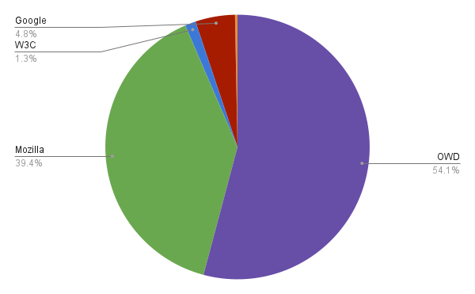
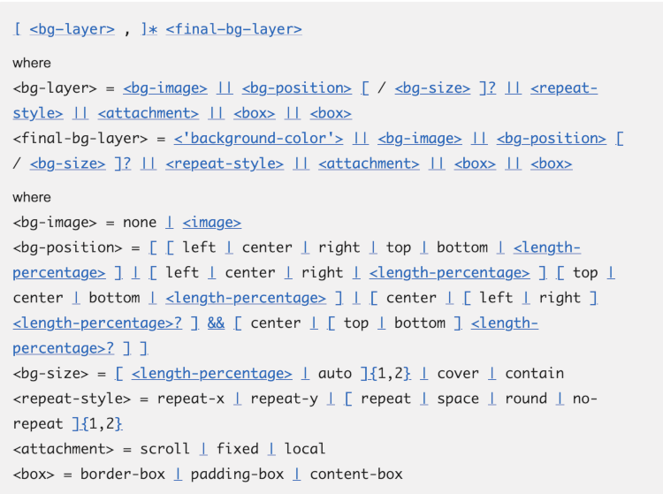
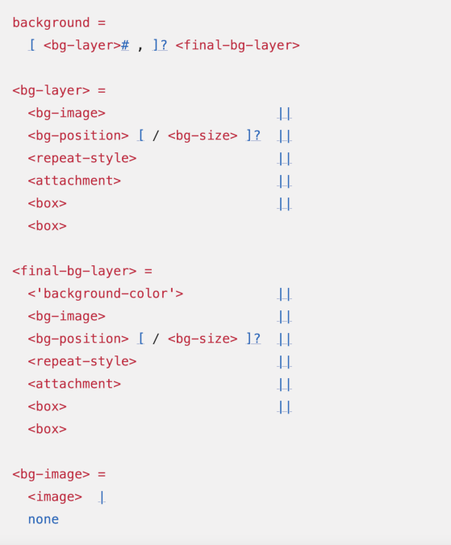

## Executive summary

Open Web Docs (OWD) is an open source collective that employs technical writers to publicly document open web technologies. OWD currently employs 4 full time writers and one part time writer, all of whom have extensive experience with Web standards documentation and MDN Web Docs. The OWD team writes new documentation, updates existing documentation, and improves documentation infrastructure.

Open Web Docs’ main focus has been contributions to [MDN Web Docs](https://developer.mozilla.org), the premier platform for Web platform documentation.

In 2022, OWD writers were the main contributors to MDN Web Docs.

- OWD was the single organization with the greatest number of PRs merged to the MDN content repository.
- OWD provided 60% of all pull request reviews to the MDN content repository.
- The OWD team executed a number of writing and documentation infrastructure projects, including:
  - Modernizing the JavaScript used in thousands of code samples across MDN, ensuring all examples demonstrate modern best practices
  - Creating and extending documentation to meet the needs identified in the [Interop 2022](https://web.dev/interop-2022/) project, including documenting CSS Colors and Cascade layers,
  - Completely rewriting the documentation for the Performance APIs
  - Rewriting CSS core principles of inheritance, specificity and the cascade.
  - Documenting all ARIA roles and attributes,
  - Making MDN more inclusive by ensuring all examples identify document language, have an appropriate character set, and are responsive, every image has alt text, and human names used in code examples better reflect the diversity of those reading MDN.
  - Establishing [overall themes](https://github.com/openwebdocs/project/blob/main/steering-committee/themes.md) for prioritized work

## What is MDN and why does it matter?

In 2022, OWD staff primarily worked on improving and extending [MDN Web Docs](https://developer.mozilla.org).

MDN is a website documenting front-end open web technologies, in particular JavaScript, CSS, HTML, HTTP, ARIA, SVG, MathML, and the JavaScript APIs available in web browsers.

MDN is the top destination for developers to learn about web technologies. It's not just a popular website for web developers, it is an essential tool that they consult on a daily basis in their work. It provides value to all organizations that depend on the web to any extent .

- MDN is the second most cited documentation site on Stack Overflow, after learn.microsoft.com ([Source](https://meta.stackoverflow.com/questions/417189/which-sites-are-currently-linked-to-most-often-in-stack-overflow/417190#417190))
- MDN is visited by 17 million developers every month
- MDN's JavaScript, CSS, and HTML documentation are routinely seen as the standard language references
- MDN is the only site with comprehensive reference documentation for the web platform APIs

## MDN content maintenance

Infrastructure and operational costs for operating and maintaining the MDN website at developer.mozilla.org are borne by Mozilla, but the largest and most valuable part of MDN is the content itself. The web platform is big and constantly evolving: MDN contains over 11,000 pages, and the content needs ongoing updating and maintenance as new web platform features are introduced and best practices change.

MDN's content is maintained as an open source project with active contributors including Mozilla staff, Open Web Docs staff, various individuals paid by their employer to contribute, and a volunteer community.

Among these groups, Open Web Docs has been the primary maintainer of MDN content for the last two years.

Reflecting its reach and importance to developers, the main MDN content repository, https://github.com/mdn/content, is one of the most active repositories on GitHub. According to https://git-pulse.github.io/snapshots/, it has:

- the fifth most commits per month (2683)
- the seventh most committers per month (193)

In 2022, 8231 pull requests (PRs) were merged to mdn/content, from 1693 contributors (excluding bots).

The main organizations contributing pull requests were as follows:

| OWD  | Mozilla | W3C | Other |
| ---- | ------- | --- | ----- |
| 1210 | 605     | 258 | 6158  |

This tells us that OWD contributed twice as many PRs as any other organization, and that "Other" was by far the biggest category.

The "Other" category is mostly individual volunteers, although it also includes some technical writers sponsored by other organizations to contribute to MDN. There's a very long tail of MDN contributors: 1293 of MDN contributors in 2022 - about three-quarters of the total - had only one merged PR in the year. However, MDN also has several extremely active volunteer contributors who make a big difference to the site.

Supporting this volunteer community is a major part of OWD's work. Sometimes this support consists simply of responding to PRs with review feedback, but the OWD team also plays a more active role, by leading projects in which we define what has to be done and breaking down tasks into manageable pieces, which are then implemented by volunteers. For example:

- The OWD project to modernize JavaScript code samples on MDN was executed through over 200 PRs, almost all contributed by volunteers.
- The OWD project to add meaningful `alt` attributes to all images on MDN followed a similar model. The `alt` attribute was added to images in all code examples, and over 500 images were made accessible.

In this way OWD acts as a force multiplier for the MDN project.

One way to measure OWD's impact is to look at reviews of pull requests authored by the volunteer community.

PR reviews for the mdn/content repository are performed by members of the maintainer group, which consists of OWD staff, Mozilla staff, W3C staff, and a select group of volunteer maintainers. Of the 7289 reviews of PRs from volunteer contributors that were merged to mdn/content in 2022, the review breakdown is as follows:

| OWD  | Mozilla | W3C  | Other |
| ---- | ------- | ---- | ----- |
| 4831 | 744     | 1083 | 631   |

In other words, OWD performed 2/3 of all reviews of PRs from the volunteer community.

## Browser compatibility data maintenance

After mdn/content, the mdn/browser-compat-data project is the biggest part of MDN. This project maintains machine-readable data on browser support for web platform features. This powers the MDN website as well as other tools like [Can I use](https://CanIUse.com), Firefox Developer Tools, and VS Code.

In 2022, 2291 pull requests were merged to the mdn/browser-compat data repository (excluding bots).

The main organizations contributing pull requests were as follows:

| OWD | Mozilla | W3C | Google | Other |
| --- | ------- | --- | ------ | ----- |
| 678 | 771     | 86  | 246    | 510   |

This shows that contributions are roughly split equally between OWD, Mozilla, and everyone else.

This view obscures the massive contribution of [Vinyl Da.i'gyu-Kazotetsu](https://github.com/queengooborg), who alone was responsible for slightly more than half the total contributions to the project. Vinyl is employed by both OWD and Mozilla, so we have simply split her contributions between the two organizations.

PR reviews for the mdn/browser-compat-data repository are performed by peers and owners of the project, who are listed in the project’s [governance document](https://github.com/mdn/browser-compat-data/blob/main/GOVERNANCE.md).

Of the 990 reviews of PRs from volunteer contributors that were merged to mdn/browser-compat-data in 2022, the review breakdown is as follows:.

| OWD | Mozilla | W3C | Google | Other |
| --- | ------- | --- | ------ | ----- |
| 536 | 390     | 13  | 48     | 3     |

Again, Vinyl Da.i'gyu-Kazotetsu was responsible for more than half of all reviews, and again, we have split her contributions between the OWD and Mozilla.

## MDN projects

This section presents a qualitative assessment of the impact of Open Web Docs on MDN, by focusing on some of the projects led by OWD in 2022.

We're proud to have been able to carry out these projects and think they make MDN an even more valuable resource for web developers.

### JavaScript code sample modernization

JavaScript has changed dramatically in the last 10 years, especially with the 2015 update known as ES6.

MDN contains thousands of JavaScript code samples, and many areas had never been systematically modernized. This meant that a great many examples on MDN contained coding practices that are now considered unreliable, hard to read, or inefficient.

Having up to date code samples demonstrating modern best practices is important because it means people will learn good practices, will teach each other good practices by citing MDN, and will incorporate good practices into their code when they copy MDN code samples.

In 2022 Open Web Docs led a project to:

- [define modern coding standards](https://github.com/orgs/mdn/discussions/143) for MDN's JavaScript code samples
- update all MDN's code samples to align with this standard.

Because the updates needed could be clearly defined and easily parallelised, it was a very good fit for a community-powered project, and most of the actual updates were made by volunteers. However, the project was led and coordinated by OWD staff and would certainly not have happened without their involvement.

In all:

- more than 200 PRs were merged by more than 20 volunteers
- OWD staff, and volunteers guided by OWD staff, updated most of the 16332 static examples across 6396 MDN pages.

There is still work to do here: for example, this project was restricted to the core JavaScript language and did not address browser APIs. However, this project has made MDN a much more useful resource.

### Performance APIs

A group of Performance engineers participating in the [Performance API W3C Working Group](https://www.w3.org/webperf/) spent time to review and to [report opportunities for improvements in MDN’s Performance docs](https://github.com/openwebdocs/project/issues/62).

We have taken this feedback and created a project to revamp about 150 reference pages that belong to this family of APIs that measure performance of websites and web applications. Over the years, many new innovations like [Performance Observers](https://developer.mozilla.org/en-US/docs/Web/API/PerformanceObserver), [User Timing](https://developer.mozilla.org/en-US/docs/Web/API/User_Timing_API/Using_the_User_Timing_API), [LCP](https://developer.mozilla.org/en-US/docs/Web/API/LargestContentfulPaint), [Server Timing](https://developer.mozilla.org/en-US/docs/Web/API/PerformanceServerTiming), etc. have been added. These concepts were presented on their own, but weren’t integrated into a single Performance API documentation set to paint a holistic picture of how to measure performance using these features. The [Performance API page](https://developer.mozilla.org/en-US/docs/Web/API/Performance_API) now presents all of the different Performance API modules in one place and gives a better overview to developers of what can be measured and how.

The introduction of Performance Observers has been key to this family of APIs. So, much like you’d expect the use of Promises in JavaScript docs these days, we have modernized the Performance API docs to talk about Performance Observers. At same time we clearly marked features of the old Performance APIs as deprecated or deleted content for removed APIs entirely.

In 2023 we’re aiming to finish this project by updating the guide pages that live next to the Performance API reference pages.

### Interop 2022

Interop is a cross-browser initiative to address important web platform interoperability features. Browser vendors all implemented the [Interop 2022](https://hacks.mozilla.org/2022/03/interop-2022/) priorities they agreed upon. The OWD team ensured all the new and updated features were documented. Projects included:

- Worked with MDN to develop new cascade layer documentation, and in the process wrote or rewrote all the !important, specificity, and cascade and inheritance documentation; the most visited CSS pages on MDN.
- Revamp MDN CSS color documentation to include new CSS Color spaces and CSS color functions (OWD project
- Several Interop 2022 features were previously documented on their own property, API, and data type pages. Our team worked to ensure interop features, like scroll behavior and the new viewport units were not just listed on their individual pages, but included within examples and reference sections in other pages to alert developers to their existence and encourage their adoption.

MDN has been documenting features for many years. Some features are fully supported in all evergreen browsers thanks to Interop 2022 and other efforts, but the documentation predating full support still mentioned “when supported”, “Internet explorer”, and outdated terms like CSS3 and HTML5. Our team eliminated outdated references, updating documentation for all Interop 2022 focus areas to reflect full support and include updated code examples.

### Integrating W3C specifications into MDN

MDN's CSS documentation shows web developers the syntax of CSS properties using a notation from the W3C specifications in which the features are defined. This is an essential feature of MDN, as it provides a precise description of property syntax. However, MDN maintained its own copy of the property syntax, which had to be manually synchronized with the specifications. As a result of this, the content on MDN was frequently out of date.

W3C has a tool called [webref](https://github.com/w3c/webref), which scrapes the specifications and presents some of their content in a machine-readable format. In 2022, OWD staff integrated webref into MDN as the source of CSS syntax values. This means the property syntax is always kept in sync with the specifications, and developers will no longer see outdated information.

We also updated the code that renders property syntax on MDN pages to make it more readable, adding pretty-printing and syntax highlighting. This means that a CSS property whose syntax used to look like this:

...now looks like this:

These two changes - more accurate content, clearly presented - make it much easier for web developers to work with CSS.

This project greatly benefited from OWD's close connections with W3C. While it serves the users of MDN, it also enables OWD to provide feedback to W3C on how they can make specifications more accessible.

## Write the Docs

In May, OWD hosted a session at the[ Writing Day](https://www.writethedocs.org/conf/portland/2022/writing-day/) during the[ Portland 2022 edition of the Write the Docs conference](https://www.writethedocs.org/conf/portland/2022/). Write the Docs is a conference for people involved with all aspects of documentation, including writers, developers, editors, information architects and more.

For the Writing Day OWD prepared a project to remove `var` from code samples in the JavaScript documentation on MDN, replacing it with `const` or `let` as appropriate. We were joined by about 20 volunteers, most of whom had never made a GitHub pull request before. With our help, volunteers removed `var` from 254 pages in the JavaScript reference.

Eventually, this project turned into a much larger project to modernize all MDN’s JavaScript code samples across the whole site.

## Shared Investment is Lasting Investment?

From end-user applications to developer tools to new APIs, developing for the web platform relies on access to accurate, vendor-neutral information and how-to. Thanks to the generous support of our steering committee participants and funding partners, Open Web Docs has:

- Retained key talent, including some of the original architects of MDN, and engaged them on core projects that have
  - Grown the impact of web documentation by making it more relevant, contextual, and available for everyday developers
  - Reinforced the collective community management and caretaking of web platform documentation - no single company could begin to recreate these resources, or manage them alone
  - Supported new contributors, mentoring tomorrow’s top-class tech talent on best practices and content development at web scale
- Spread collective responsibility and investment in common digital infrastructure among multiple vendors, which
  - Reduces risk to the project
  - Increases visibility and “ownership” behaviors among invested parties
  - Strengthens reliability, longevity, and trustworthiness
  - Reduces costs
- Improved breadth and quality of the information and data on
  - Core reference documentation
  - Browser Compatibility
  - Hot-topic technologies for next generation application development such as AR/VR, security, and privacy-protecting technologies

These investments have not only helped developers learn and adopt web technologies; they have also helped countless organizations build more modern, secure, and performant products and services.

## 2022 Budget Recap

OWD is very grateful to its Platinum Members Google and Microsoft, Gold Members Igalia and Meta, and Silver Members Canva and JetBrains for their membership in 2022. Since its inception in January 2021, Open Web Docs has raised $1.8m from nearly 200 individual and organizational supporters. OWDS’s annual operating budget is $800k.

Payroll is Open Web Docs’ only meaningful expense. OWD employs four full time technical writers and one part time contractor. Employees are paid competitive salaries in their local currency, and receive health care and other regionally compliant benefits. In 2022, OWD spent a total of $777k on payroll, contractors, transaction fees and minor operating expenses. We post all transactions on our Open Collective page.

Our sponsors have invested significantly in engineering resources to optimize and improve their browser platforms, which are built on the open web. OWD tests and documents these innovations so that they reach the widest possible number of consumers, saving vendors the cost of maintaining separate sites and reinforcing the value of our shared investment in the web. Platinum sponsors also participate in the governance of the project and help set OWD’s project roadmap and priorities.

For 2023, $500,000 has been committed by platinum sponsors Google and Microsoft, $40,000 has been verbally committed by Gold and Silver sponsors, and $10,000 is anticipated to come from individual open collective sponsors for a total of $550,000.

## Gratitude for our Individual Supporters

Our individual supporters have helped raise nearly $20k for better web platform documentation since 2021 - we are beyond grateful to:

- Aaron
- Aaron Gustafson
- aetos
- Alex Rosenkranz
- Anatoly Ostapenko
- Andreas Kling
- Andrew Chou
- Andrew Sutherland
- Andy Piper
- Baldwin Chang
- Ben Galbraith
- Benjamin Altpeter
- Benjamin Piouffle
- Bertram Gao
- Brendan Ardagh
- Bruce garrett
- Canva
- casaper
- César Ornelas
- Chris Hayes
- Chris Heilmann
- Chris McGhee
- Clueless Ruler Music
- codev
- Coil
- Damien Clauzel
- Daniel Ehrenberg
- Danny McGee
- Danny W
- Daren Chandisingh
- Dominic Cooney
- Dominic Cooney
- Eric Casthart
- Eric Shepherd
- Ethan Resnick
- EthicalAds
- facebook
- Facebook Open Source
- Flaki
- Fund OSS
- Garouz
- Germain Souquet
- Google Open Source
- groovecoder
- Grunet
- Guest
- Guest
- Guest
- Guest
- Guest
- Gyuri Lajos
- Harry Dent
- Harry Dent
- Hiroyuki Ota
- Igalia SL
- Ilya Diallo
- Ilya f
- Incognito
- Incognito
- incognito
- Itai Noam
- Jad Joubran
- Jan P
- Jaroslav Kubicek
- Jeff Posnick
- Jens Oliver Meiert
- Jeremie Patonnier
- JetBrains
- Joel Marcey
- John Whitlock
- Jonathan Finch
- Jory Burson
- Joseph Kesselring
- Julien G
- Julien Vanélian
- Julius Tarng
- Junya Kono
- Justin Ridgewell
- Jxck
- Kayce Basques
- Keith Kurson
- Kenneth Rohde Christiansen
- Kiganix
- Kostas Bariotis
- Kotaro Morooka
- kukhyun
- Kyle Pflug
- Laurent le Beau-Martin
- Leo Balter
- Leonardo Kewitz
- Lifina
- lim
- Logan Henrie
- Marcus Weiner
- Mark Reeves
- Mark Reeves
- Martijn Arts
- Masataka Yakura
- Matt Lindeboom
- Michael Leggett
- Michael[tm] Smith
- Microsoft Edge
- Milica Mihajlija
- mimonelu
- Mitchell Harris
- Moto Ishizawa
- Nazar Mokrynskyi
- neuland - Büro für Informatik
- Open Collective
- Open Collective
- Oskar Oldorf
- Oussama Romdhane
- Owen Valentine
- Patrick Kettner
- Paul Kinlan
- Pelle Wessman
- Pete LePage
- Peter Antonius
- Peter deHaan
- Peter Rushforth
- Pia Mancini
- Rad Web Hosting
- Rick Byers
- Robert Ma
- Romulo Cintra
- Russell Beattie
- Ryan Prior
- Sam Chen
- Samsung Internet
- Scott Hallock
- Scott Kennedy
- Sebastian Zartner
- Sergio Moraes
- Sharat M R
- Shinichi Segawa
- simochee
- Stephanie Eckles
- Stilyan Mihalev
- Surma
- Takayuki Shimada
- takehiroman
- Thomas Berntsen
- Thomas Steiner
- tim richardson
- Tom Leen
- Tom Leo
- Tomasz Kleszczewski
- tomita
- Tommy Williams
- Tsubasa Nomura
- Tyler Wilcock
- Type of Web
- Victor Neo
- Vincent Ramdhanie
- Vladimir Ivanenko
- Xidorn Quan
- Yasuhiro Яша Asaka
- Yoichi Fujimoto
- Yu Matsuzawa (ymtszw)
- Yuhei Yasuda
- Yukio Arita

## Looking forward to 2023

In 2023, OWD is excited to continue to work very closely with Mozilla on MDN Web Docs. At the end of 2022, Mozilla and OWD created a [shared and open roadmap](https://github.com/orgs/mdn/projects/26/) for ongoing and planned work. With the help of this tool, the Open Web Docs team will collaborate actively and give direct input even more on MDN’s information architecture, compatibility data, content structures, code examples, and other changes coming impacting all sections of the MDN Web Docs site.

Within Open Web Docs’ Steering Committee we will continue to plan and execute projects on a quarterly basis. We’re inviting all of our partners for another year of supporting web platform documentation for the benefit of web developers & designers worldwide. We also aim to strengthen our collaborations with existing initiatives like continuing to support Interop and working with the [W3C WebDX Community Group](https://www.w3.org/community/webdx/) to improve the general developer experience for people developing for the web.
