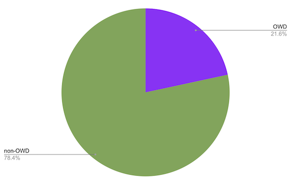
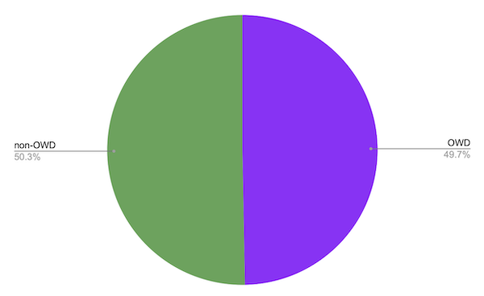
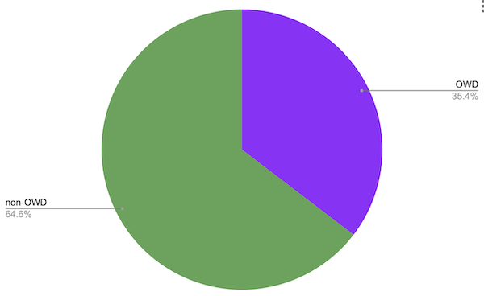
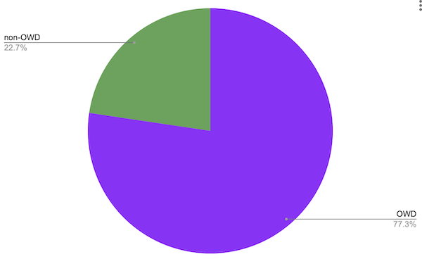

## Executive summary

Open Web Docs is taking a look at how our efforts have helped to ensure the long-term health of web platform documentation on critical resources like MDN Web Docs, independently of any single vendor or organization. Founded in January 2021, the year 2023 marks Open Wed Docs’ third year of operation!

Open Web Docs (OWD) is an open source collective that employs technical writers to publicly document open web technologies. OWD currently employs four full time writers and one part time writer, all of whom have extensive experience with Web standards documentation and MDN Web Docs. The OWD team writes new documentation, updates existing documentation, and improves documentation infrastructure together with other organizations such as Mozilla, Google, Microsoft, W3C, other external contributors and volunteers.

In 2023, Open Web Docs:

- Was the organization that contributed the greatest number of pull requests (PRs) merged to the [mdn/content](https://github.com/mdn/content) and [mdn/browser-compat-data](https://github.com/mdn/browser-compat-data) repositories.
- Provided 50% of all pull request community reviews to the mdn/content repository and 77% of community reviews to mdn/browser-compat-data.
- Completed major technical writing and documentation engineering projects which were determined and guided by OWD’s [Steering Committee](https://github.com/openwebdocs/project/blob/main/steering-committee/membership-expectations.md). This included among other things:
  - [Rewrite, update, and expansion of the Progressive Web App docs](https://blogs.windows.com/msedgedev/2023/08/09/pwa-documentation-mdn-web-docs-open-web-docs/)
  - [Retitling of 4000 pages in MDN’s Web/API reference documentation](https://openwebdocs.org/content/posts/web-api-page-titles/)
  - [Accurate compatibility data going back to at least 2020](https://github.com/openwebdocs/project/issues/85)
- Secured an [investment from the Sovereign Tech Fund](https://openwebdocs.org/content/posts/sovereign-tech-fund/) to implement improved tooling and maintenance of the [mdn/browser-compat-data](https://github.com/mdn/browser-compat-data) project and development of the [openwebdocs/mdn-bcd-collector](https://github.com/openwebdocs/mdn-bcd-collector) tool.
- Joined the W3C WebDX Community Group, helped define Baseline and started creating feature groups for the web platform.
- Started research on [Web Security documentation to Secure The Web Forward](https://openwebdocs.org/content/posts/secure-the-web-forward/).

Previous Open Web Docs Impact and Transparency Reports: [2022](https://openwebdocs.org/content/reports/2022/), [2021](https://openwebdocs.org/content/reports/2021/).

Open Web Docs is a non-profit, strongly community-focused open source collective that uses its donations to employ a group of technical writers who are dedicated to writing and improving documentation for the web platform.

Donate today:
- <a href="https://github.com/sponsors/openwebdocs">GitHub Sponsors</a>
- <a href="https://opencollective.com/open-web-docs">Open Collective</a>

Also, tell your company to support us with a membership!
A supporting [member organization](https://openwebdocs.org/membership) of Open Web Docs offers benefits in addition to supporting core web platform documentation and engineering. Reach out to [florian@openwebdocs.org](mailto:florian@openwebdocs.org) for more information.

## MDN content maintenance

In 2023, OWD staff continued to work on improving and maintaining the [mdn/content](https://github.com/orgs/mdn/) repository and its related tooling.

[MDN Web Docs](https://developer.mozilla.org/), [DevDocs](https://devdocs.io/), and other projects source their pages from the [mdn/content](https://github.com/orgs/mdn/) GitHub repository. Documentation about open web standards needs ongoing updating and maintenance as new web platform features are introduced and best practices change. MDN is not just a popular website for web developers, it is an essential information source that web developers consult and trust on a daily basis. OWD believes that by contributing to the mdn/content repository, we have the biggest impact on open web platform documentation in the ecosystem.

### Content pull requests authored

Like in previous years, Open Web Docs was the primary contributor to the mdn/content repository, contributing 21.6% of all merged pull requests (PRs) in 2023. In Git Pulse rankings the mdn/content repository remains in the top 10 of all of the repositories hosted on GitHub, see [git-pulse.github.io](https://git-pulse.github.io/snapshots/).

In 2023, 5137 pull requests were merged to the mdn/content repository (excluding bots).

As in previous years, there's a very long tail of MDN contributors. We can also group all contributors into three categories: one-timers, casual contributors (2-9 PRs) and core contributors (10+ PRs):

- 974 contributors had 1 PR merged.
- 259 contributors had 2-9 PRs merged.
- 45 contributors had 10 or more PRs merged.

### Content pull requests reviewed

Supporting this long tail of volunteers is a large part of OWD's work. One way to measure OWD's impact is to look at reviews of pull requests (PRs) authored by the volunteer community.

PR reviews for the mdn/content repository are performed by members of the maintainer group, which consists of OWD staff, Mozilla, Google and Microsoft staff, W3C staff, and a select group of volunteer maintainers. Of the 3688 reviews of PRs from volunteer contributors that were merged to mdn/content in 2023, OWD performed half (49.7%) of all reviews of PRs from the volunteer community. Special shout out to volunteer reviewer [Josh-Cena](https://github.com/Josh-Cena), who took on a lot of reviews in 2023.

## Browser compatibility data maintenance

The [mdn/browser-compat-data](https://github.com/mdn/browser-compat-data/) project is the second largest MDN project. This project maintains machine-readable data about browser support for web platform features. Browser compatibility data is used within the MDN website to populate feature compatibility tables as well as other tools like [Can I use](https://caniuse.com/), Firefox Developer Tools, [Baseline](https://developer.mozilla.org/en-US/blog/baseline-unified-view-stable-web-features/), and VS Code.

### Compatibility data pull requests authored

In 2023, 1934 pull requests were merged to the mdn/browser-compat-data repository (excluding bots).

Like in 2022, it's not visible in this view is the massive contribution of [Vinyl Da.i'gyu-Kazotetsu](https://github.com/queengooborg), who alone was responsible for more than half of the total contributions (989 PRs) to the project. Vinyl is contracted by both OWD and Mozilla, so we only attributed half of her contributions to Open Web Docs.

### Compatibility data pull requests reviewed

PR reviews for the mdn/browser-compat-data repository are performed by peers and owners of the project, who are listed in the project’s [governance document](https://github.com/mdn/browser-compat-data/blob/main/GOVERNANCE.md).

Again, because Vinyl Da.i'gyu-Kazotetsu contracts for both Open Web Docs and Mozilla, we have only attributed 50% of her contributions to OWD.

Taking into account reviews of PRs from everyone, including other maintainers (not just those submitted from the volunteer community as shown above), we need to give a shout out to [Florian Scholz](https://github.com/Elchi3) for providing 1,151 reviews (57% of all BCD reviews) in 2023. That's 4.4 BCD PR reviews per working day! Vinyl Da.i'gyu-Kazotetsu authored 989 merged PRs, so Vinyl and Florian were the perfect BCD team in 2023!

## Sovereign Tech Fund

Open Web Docs is very proud to have received an investment from the Sovereign Tech Fund in 2023. The [Sovereign Tech Fund (STF)](https://sovereigntechfund.de/en) supports the development, improvement, and maintenance of open digital infrastructure in the public interest. The [Sovereign Tech Fund’s Contribute Back Challenges](https://sovereigntechfund.de/en/challenges/) selected Open Web Docs as a partner to implement improved tooling and maintenance of the [mdn/browser-compat-data](https://github.com/mdn/browser-compat-data) and further development of the [openwebdocs/mdn-bcd-collector](https://github.com/openwebdocs/mdn-bcd-collector) tool.

As part of this program, we worked on two key deliverables and completed key project milestones:

Deliverable 1: [Implement a process for updating BCD whenever a new browser release is available](https://github.com/openwebdocs/project/issues/168)

- Automatic detection of new browser version releases
- Improved the collector’s coverage of BCD from 80% to 90%
- Defined and tested reviewable pull requests
- Creating pull requests (semi)-automatically (ongoing)

Deliverable 2: [Build a catalog of web platform features](https://github.com/openwebdocs/project/issues/169)

- Created a workflow and collaboration between W3C WebDX and BCD
- Updated the browser-compat-data schema to include tags, making it possible to assign BCD features to web-features groups directly.
- Grouping web platform features (ongoing)

We developed an automation toolchain to reduce the time gap between browser releases and the availability of updated data. This significantly benefits compatibility data consumers, including MDN Web Docs, CanIUse, and code editors displaying browser compatibility information. This work is benefitting the  millions of web developers who use these resources and tools daily.

New browser versions are released every few weeks, with three main browser engines issuing releases. This means there are 30-40 new browser releases every year! The designed pipeline for automated updates of compatibility data is helping the mdn-browser-compat data project enormously in managing this challenge and will only become more impactful going forward.

In addition to the direct work on BCD data collection, the OWD team collaborated closely with the [W3C WebDX group](https://www.w3.org/community/webdx/). Our participation has been instrumental in defining the [Baseline status](https://github.com/web-platform-dx/web-features/blob/main/docs/baseline.md) for web platform features and we have worked to catalog [web-features](https://github.com/web-platform-dx/web-features/). By creating a common nomenclature for web platform features, we support communication between web developers, browser vendors, standardization bodies, and other ecosystem participants.

## Open Web Docs BCD Collector tool

In 2023, Open Web Docs became the new owner of the [mdn-bcd-collector](https://github.com/openwebdocs/mdn-bcd-collector) project. This set of tools stands at the heart of collecting compatibility data, enabling automation, and maintaining structured compatibility data. Clarifying and transferring the governance of the mdn-bcd-collector to the OWD organization has led to quicker reviews, as maintainers are now all working on the same code base and prior forks have been archived. We also see more people actively maintaining the project with more joy. OWD would like to extend a huge thanks to Philip Jägenstedt, Vinyl Da.i'gyu, Lola Odelola, Z Goddard, and Chris Cuellar for making this happen and for their key contributions to the collector.

## **OWD project work**

The Open Web Docs [Steering Committee](https://github.com/openwebdocs/project/blob/main/steering-committee/membership-expectations.md) meets on a weekly basis to determine project work for OWD's technical writing staff. The Steering Committee is guided by the [OWD prioritization criteria](https://github.com/openwebdocs/project/blob/main/steering-committee/prioritization-criteria.md) and OWD’s [charter](https://github.com/openwebdocs/project/blob/main/charter.md). We prioritize based on the needs of the global community of web developers and designers. The [project proposal submission](https://github.com/openwebdocs/project/issues/new/choose) process is open to everyone, with proposals reviewed by the Steering Committee.

Some of the major projects Open Web Docs completed in 2023 were:

### Progressive Web App documentation

In partnership with OWD Platinum sponsor Microsoft Edge, we [rewrote, updated, and greatly expanded the Progressive Web App (PWA) documentation](https://blogs.windows.com/msedgedev/2023/08/09/pwa-documentation-mdn-web-docs-open-web-docs/) on MDN.

We wrote new guides, taking readers from understanding [what Progressive Web Apps are](https://developer.mozilla.org/docs/Web/Progressive_web_apps/Guides/What_is_a_progressive_web_app), to [making them installable](https://developer.mozilla.org/docs/Web/Progressive_web_apps/Guides/Making_PWAs_installable), supporting [offline scenarios](https://developer.mozilla.org/docs/Web/Progressive_web_apps/Guides/Offline_and_background_operation), and discovering [best practices](https://developer.mozilla.org/docs/Web/Progressive_web_apps/Guides/Best_practices).

We also wrote many how-to articles, focusing on just specific technical aspects of PWA, and going deep into the details. For example, [defining app icons](https://developer.mozilla.org/docs/Web/Progressive_web_apps/How_to/Define_app_icons), [sharing data between apps](https://developer.mozilla.org/docs/Web/Progressive_web_apps/How_to/Share_data_between_apps), [handling files](https://developer.mozilla.org/docs/Web/Progressive_web_apps/How_to/Associate_files_with_your_PWA), and [triggering app installation](https://developer.mozilla.org/docs/Web/Progressive_web_apps/How_to/Trigger_install_prompt).

Finally, we created a six-part [introductory-level tutorial](https://developer.mozilla.org/docs/Web/Progressive_web_apps/Tutorials/CycleTracker) that walks the reader through all the steps needed to create a basic PWA, from scratch. The tutorial includes a line-by-line explanation of the HTML, CSS, and JavaScript needed for the PWA, along with setting up a local development environment or secure connection, creating a manifest to provide the identity, appearance, and iconography of the PWA, along with writing, debugging, and resetting service workers. This tutorial is a great way to get started with PWAs, even if you’ve only just started with web development.

Thank you to Patrick Brosset, for the collaboration.

### Documenting CSS specifications

Originally, CSS was a single specification. After CSS 2.1, CSS specifications were broken up into multiple feature specs. Over 100 specs, in fact. With many new features landing in each new browser release and specs being updated all the time, the documentation grew inconsistent in how the features in the specifications were presented. Throughout 2023, OWD [overhauled MDN CSS documentation, module by module](https://github.com/openwebdocs/project/issues/147), creating or improving landing pages for 30 specifications, adding examples using multiple spec features appropriate. The completed landing pages are consistent, each with a reference section that includes the properties, glossary terms, at-rules and descriptors, data types, functions, events, and APIs introduced in by the specification, with links to the documentation explaining those features. Each module landing page also includes guides and related concepts. Every linked reference page and guide was reviewed and updated, or, in many cases, created.

This work is ongoing, with a focus on making sure Interop-related modules are up-to-date, relevant, and have excellent guides.

### Fixed compatibility data going back to at least 2020

In 2023, we made ground-breaking progress on the [data accuracy of the browser-compat-data project](https://github.com/openwebdocs/project/issues/85). We managed to eliminate almost all of the “null” and “true” in BCD. In a concentrated effort, we used our BCD collector tool to find version numbers for almost all BCD features going back to 2020 (and often even further into the past). The [Baseline project](https://github.com/web-platform-dx/web-features/blob/main/docs/baseline.md) benefits enormously from all of Open Web Docs' work to provide accurate compatibility data. Out of 14,366 BCD features only 283 are still unresolvable when attempting to calculate their baseline status. We'll figure out the remaining 283 data points! We are proud how useful BCD has become as a data source thanks to our ongoing maintenance work.

### Retitled Web/API reference documentation

The Web/API documentation is the biggest part of MDN, comprising about 6000 pages, a little over half the total. This part of MDN is especially important, as it is the only place that offers a one-stop reference for web developers of all (or nearly all) the JavaScript APIs implemented by browsers.

It’s long been an issue in the web developer community that the titles of these pages are misleading, giving an inaccurate impression of how the features are accessed by code. In 2023, we [retitled all 4000 pages in MDN’s Web/API reference documentation](https://openwebdocs.org/content/posts/web-api-page-titles/). We retitled all property, method, constructor, and event pages in Web/API building on our work to introduce page types to mdn/content.

### Reference documentation for interoperable features

Even if MDN reference docs have generally good coverage of web platform features, there are some gaps. We are working on filling them, and we decided to prioritize [creating the missing reference pages for features that are part of shipping in all three major web engines](https://openwebdocs.org/content/posts/complete-interop-features/).

We made sure that:

- All interoperable APIs unrelated to HTML and SVG are documented.
- All interoperable HTML APIs, not part of the DOM (that is, everything in the HTML spec that is not an `HTML*Element` property or method), are documented.

The [mdn-gaps](https://dontcallmedom.github.io/mdn-gaps/) tool created by Dominique Hazaël-Massieux has been very helpful for this project and future work will be to document the missing properties of HTML*Element interfaces and to ensure the documentation quality of all interoperable web platform features.

### Convert all XMLHttpRequest examples to fetch()

For some years, the Fetch API has been the preferred way to make HTTP requests from JavaScript, replacing the old XMLHttpRequest (XHR) API. However, many old MDN code samples still used XHR instead of Fetch. In 2023 OWD systematically analyzed the whole of MDN to find places where the docs used XHR, and updated [all example code using XMLHttpRequest to use fetch() instead](https://github.com/openwebdocs/project/issues/156), ensuring that developers are taught current good practices.

### Securing the web forward

Open Web Docs [attended the W3C “Secure the Web Forward” workshop to work out a plan for better web security documentation](https://openwebdocs.org/content/posts/secure-the-web-forward/). The W3C workshop [Secure the Web Forward](https://www.w3.org/2023/03/secure-the-web-forward/index.html) workshop was held virtually on September 26-28, 2023 with the goal to drive developer awareness and adoption of web security standards & practices. We handed in a position paper called [Documentation for web security education](https://www.w3.org/2023/03/secure-the-web-forward/papers.html#owd) and presented our paper as part of the "Developer awareness" track on the last day of the workshop. In the paper, we’ve taken a look at the [MDN short survey results on web security](https://github.com/web-platform-dx/developer-research/blob/main/mdn-short-surveys/2023-05-15-security-dx/interpretation.md).

The talk was recorded: [Video & transcript](https://www.w3.org/2023/03/secure-the-web-forward/talks/owd.html), [HTML slides](https://florianscholz.com/security-docs-workshop/), [PDF slides](https://www.w3.org/2023/03/secure-the-web-forward/talks/slides/owd.pdf).

## 2023 Budget

OWD is very grateful to its Platinum Members Google and Microsoft, its Gold Member Igalia, and its Silver Member Canva for their membership in 2023. Since its inception in January 2021, Open Web Docs has raised $2.4m from nearly 200 individual and organizational supporters.

Additionally, the Sovereign Tech Fund invested 150,000€ in Open Web Docs in 2023 as part of the STF Contribute Back Challenge (round 1).

Payroll is Open Web Docs’ only meaningful expense, and in 2023 we adjusted the salary of OWD Staff to account for inflation and to better reflect market rates. It's the first time compensation was adjusted since November 2020. OWD employs four full time technical writers and one part time contractor. Employees are paid competitive salaries in their local currency, and receive health care and other regionally compliant benefits. In 2023, OWD spent a total of $848k on payroll, inclusive of contractors, taxes, wire fees, exchange fees and payroll services. Minor operating expenses ($2.7k) and transaction fees on collective revenue ($36k) account for the balance of OWD expenses. We post all transactions on our [Open Collective](https://opencollective.com/open-web-docs) page.

## 2024 Financial Forecast

For 2024, $500,000 has been committed by platinum sponsors Google and Microsoft, $40,000 has been committed by Gold sponsor Igalia and Silver sponsor Canva. About $10,000 is anticipated to come from individual open collective sponsors for a total of $550,000. Additionally, the Sovereign Tech Fund’s Contribute Back Challenge will continue in 2024 and we will see an additional investment into browser compatibility data tooling worth 150,000€ as part of round 2 of the challenge.

Open Web Docs is actively looking for additional sponsors in 2024 in order to continue our project work at full capacity. Becoming a supporting member of Open Web Docs offers benefits in addition to supporting core web platform documentation and engineering. Email [florian@openwebdocs.org](mailto:florian@openwebdocs.org) for more information.

## **Gratitude for our Individual Supporters in 2023**

Thank you to each and everyone who supports us with recurring or one-time donations! Your sponsorship means the world to us!

### **Active recurring donations**

Sorted by start date.

- Kyle Pflug
- sideshowbarker
- Daniel Appelquist
- Benjamin Piouffle
- Flaki
- Andrew Sutherland
- Germain Souquet
- César Ornelas
- Julius Tarng
- Keith Kurson
- Marcus Weiner
- Scott Kenney
- Chris McGhee
- Logan Henri
- Matt Lindeboom
- Danny McGee
- Thomas Steiner
- Alex Rosenkranz
- Takayuki Shimada
- Gyuri Lajos
- Dashron
- Jaroslav Kubicek
- Harry Dent
- Tim Richardson
- Incognito
- Grunet
- Jeremie Patonnier
- Eric Casthart
- Dominic Cooney
- Jad Joubran
- Ryan Prior
- John Whitlock
- codev
- Thomas Berntsen
- Danny W
- Yasha
- Ashur Cabrera
- Dan Burzo
- Patrick Brosset
- Dave Jansen
- Julien G
- Dan Ryan
- Mechanical Ink
- Adiel Cristo
- Joe Bartlett

### One time donations

Sorted by amount contributed.

- Rick Byers
- Chris Hayes
- Jeremiah Lee
- Paul Hibbitts
- Guest
- Tony
- Incognito
- Brogan Branstetter

## Looking forward to 2024

We’re inviting all of our partners and backers for another year of supporting web platform documentation for the benefit of web developers & designers worldwide. We aim to continue with our [mission](https://github.com/openwebdocs/project/blob/main/charter.md) and foster collaborations with existing initiatives to improve the general developer experience for people developing for the web. We consider web platform docs critical digital infrastructure, and we work cooperatively to ensure its long-term health.

We are funded by corporate and individual donations. If your organization or project is interested in advancing open web platform documentation, we would love to hear from you! Please reach out to [florian@openwebdocs.org](mailto:florian@openwebdocs.org).
