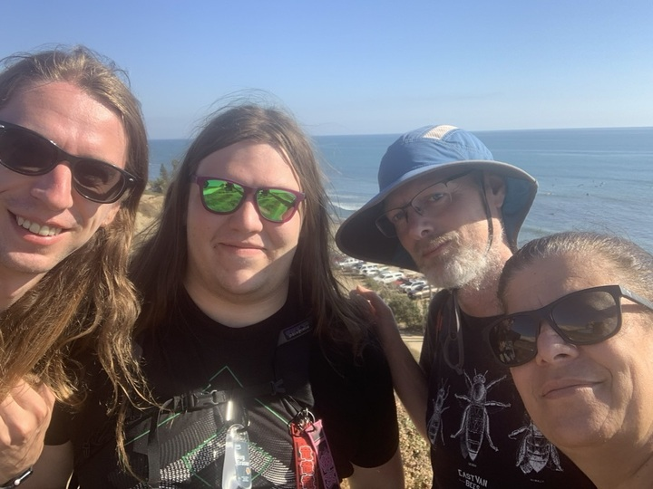

## Executive summary

Open Web Docs' work in 2024 helped ensure the long-term health of web platform documentation on critical resources like MDN Web Docs, independently of any single vendor or organization. Founded in January 2021, 2024 marked Open Web Docs’ fourth year of operation!

Open Web Docs (OWD) is an [Open Source Collective](https://opencollective.com/open-web-docs) that employs engineers to publicly document open web technologies. OWD currently employs two full time technical writers, one compat data engineering contractor, and OWD's director to run the program. Everyone at OWD has extensive experience with Web standards documentation, MDN Web Docs, and browser compatibility data. The OWD team writes new documentation, updates existing documentation, and improves documentation infrastructure. Open Web Docs works together with other organizations such as Mozilla, Google, Microsoft, W3C, Igalia, as well as the [Sovereign Tech Fund](https://openwebdocs.org/content/posts/sovereign-tech-fund/), and other external contributors and volunteers.

In 2024, Open Web Docs:

- Was again the organization that contributed the greatest number of pull requests (PRs) merged to the [mdn/content](https://github.com/mdn/content) (14.1%) and [mdn/browser-compat-data](https://github.com/mdn/browser-compat-data) (52.4%) repositories.
- Provided 27% of all pull request reviews to the mdn/content repository and 52% of reviews to mdn/browser-compat-data.
- Became a maintainer of the [web-platform-dx/web-features](https://github.com/web-platform-dx/web-features) repo and contributed 14.8% of merged pull requests.
- Completed major technical writing and documentation engineering projects which were determined and guided by OWD’s [Steering Committee](https://github.com/openwebdocs/project/blob/main/steering-committee/membership-expectations.md). This included among other things:
  - [Collecting browser compatibility data for every browser release, including all beta releases](#collecting-browser-compatibility-data-whenever-browsers-release-a-new-beta-version)
  - [Documenting all interoperable and widely available browser features](#documenting-all-interoperable-and-widely-available-browser-features)
  - [W3C WebDX web-features mapping of BCD keys into Baseline features](#w3c-webdx-web-features-mapping-of-bcd-keys-into-baseline-features)
  - [Updated compat data to include browser support version numbers for all features](#updated-compat-data-to-include-browser-support-version-numbers-for-all-features)
  - [Improving Web Security docs for MDN with the W3C SWAG CG](#improving-web-security-docs-for-mdn-with-the-w3c-swag-cg)
  - [Updated Fetch documentation](#updated-fetch-documentation)
  - [WebView compatibility data](#webview-compatibility-data)

Previous Open Web Docs Impact and Transparency Reports: [2023](https://openwebdocs.org/content/reports/2023/), [2022](https://openwebdocs.org/content/reports/2022/), [2021](https://openwebdocs.org/content/reports/2021/).

Open Web Docs is a non-profit, strongly community-focused open source collective that uses its donations to employ a group of technical writers who are dedicated to writing and improving documentation for the web platform.

Donate today:

- [GitHub Sponsors](https://github.com/sponsors/openwebdocs)
- [Open Collective](https://opencollective.com/open-web-docs)

Also, tell your company to support us with a membership!
As a [member organization](https://openwebdocs.org/membership) you are entitled to further benefits in addition to supporting core web platform documentation and engineering. Reach out to [florian@openwebdocs.org](mailto:florian@openwebdocs.org) for more information.

## OWD maintainership by the numbers

In 2024, Open Web Docs continued to maintain and improve the following four essential web platform documentation ecosystem projects:

- [mdn/content](https://github.com/mdn/content)
- [mdn/browser-compat-data](https://github.com/mdn/browser-compat-data)
- [openwebdocs/mdn-bcd-collector](https://github.com/openwebdocs/mdn-bcd-collector)
- [web-platform-dx/web-features](https://github.com/web-platform-dx/web-features)

Open web standards documentation needs ongoing updating and maintenance as new web platform features are introduced and best practices change. At OWD, we believe the above projects are essential sources of information web developers consult and trust and that by contributing to these repositories, we can reach the majority of web developers worldwide with comprehensive, accurate and informative documentation about the open web platform.

For W3C's 30th anniversary, [François Daoust](https://github.com/tidoust) spoke about the [Web and the art of specification maintenance](https://www.youtube.com/watch?v=gkg2WBVfeho) at the 2024 annual W3C TPAC conference. OWD is proud to play a key role in the maintenance of the web's infrastructure and enhancing the overall resilience of the system.

[Git Pulse rankings](https://git-pulse.github.io/snapshots/) help to put our work in perspective in the overall open source ecosystem. In 2024, the mdn/content repository is again in the top 10 of all of the repositories hosted on GitHub!

The [web-platform-dx/web-features](https://github.com/web-platform-dx/web-features) repository is a new in the list of projects that Open Web Docs supports. It is used by MDN Web Docs and caniuse.com as well as the Baseline project, among other things. It uses browser-compat-data and we believe it is an important project to help web developers discover the capabilities of the web platform. You can explore its data on the [Web platform features explorer](https://web-platform-dx.github.io/web-features-explorer/) site and watch [Building the web developer's catalog of web platform features](https://www.w3.org/2023/09/TPAC/demos/web-features.html) by Daniel D. Beck to learn more about it.

### Pull requests authored

Since our launch in 2021, Open Web Docs has been the primary contributor to the mdn/content and the mdn/browser-compat-data repositories. In 2024, we also joined and substantially helped with W3C WebDX Community Group's web-features project. Here's the summary of merged PRs authored (excluding bots):

| Project                 | Total authored PRs | OWD authored PRs |
| ----------------------- | ------------------ | ---------------- |
| mdn/content             | 3907               | 551 (14.1%)      |
| mdn/browser-compat-data | 2034               | 1066 (52.4%)     |
| web-platform-dx/web-features     | 1150               | 170 (14.8%)      |

### Pull requests reviewed

As in previous years, there's a very long tail of contributors and a thriving community actively involved with our work. For mdn/content, we group all contributors into three categories: one-timers, casual contributors (2-9 PRs) and core contributors (10+ PRs). The 2024 breakdown looks like this:

- 708 contributors had 1 PR merged.
- 166 contributors had 2-9 PRs merged.
- 44 contributors had 10 or more PRs merged.

Supporting this long tail of volunteers is a large part of OWD's work. PR reviews for the mdn/content repository are performed by members of the maintainer group, which consists of OWD, Mozilla, Google, Microsoft, and W3C staff, and a select group of volunteer maintainers.

We want to give special shout outs to volunteer reviewer [Joshua Chen](https://github.com/Josh-Cena), who alone took on 18.3% of reviews in 2024 for mdn/content, and to [Daniel D. Beck](https://github.com/ddbeck) who reviewed more than half (56.4%) of all web-features pull requests in 2024. It is a pleasure to work with both of you and your impact in 2024 on these two projects is very noteworthy! Thank you!

Here's the summary of reviewed PRs:

| Project                 | Total reviewed PRs | OWD reviewed PRs |
| ----------------------- | ------------------ | ---------------- |
| mdn/content             | 4595               | 1254 (27.3%)     |
| mdn/browser-compat-data | 2209               | 1154 (52.3%)     |
| web-platform-dx/web-features      | 1961               | 135 (6.9%)       |

## Sovereign Tech Fund

Open Web Docs is very proud to have received a second round of investment from the [Sovereign Tech Fund (STF)](https://www.sovereign.tech/programs/fund) at the beginning of 2024. STF supports the development, improvement, and maintenance of open digital infrastructure in the public interest. [STF’s Contribute Back Challenges](https://www.sovereign.tech/programs/challenges) selected Open Web Docs as a partner to implement improved tooling and the maintenance of the [mdn/browser-compat-data](https://github.com/mdn/browser-compat-data) and further development of the [openwebdocs/mdn-bcd-collector](https://github.com/openwebdocs/mdn-bcd-collector) tool.

As part of this program, we continued the work started during from the first round, in 2023, by completing these key milestones:

- Open Web Docs (OWD) automatically update browser compatibility data using OWD’s [mdn-bcd-collector](https://github.com/openwebdocs/mdn-bcd-collector). Thanks to Open Web Docs and the MDN BCD Collector project, browser compatibility information is available to web developers for new browser releases faster than ever: data gets collected when a new beta versions of browsers are published and data is made available well before the stable browser versions get released.
- Our collector automatically detects the addition and removal of 90.15% of all browser features for the entire web platform when a new browser is released. Data collected by OWD's MDN BCD Collector is recorded in the open-source [BCD](https://github.com/mdn/browser-compat-data) project, which is used by several popular web developers tools, such as [CanIUse](https://caniuse.com/), [MDN Web Docs](https://developer.mozilla.org), [Baseline](https://github.com/web-platform-dx/web-features/blob/main/docs/baseline.md) and [web-features](https://github.com/web-platform-dx/web-features).
- OWD runs tests on mobile browsers and WebViews providing accurate compatibility data for these platforms and highlighting differences between mobile and desktop browsers.
- We also made our tooling more generally available, so that new tools, such as [runtime-compat-data](https://runtime-compat.unjs.io/) can display compatibility across different JavaScript runtimes. We are proud that our work on this data contributes to better understanding of compatibility issues, to more interoperability, and better standardization on the web platform.

## OWD project work

The Open Web Docs [Steering Committee](https://github.com/openwebdocs/project/blob/main/steering-committee/membership-expectations.md) meets on a weekly basis to determine project work for OWD's technical writing staff. The Steering Committee is guided by the [OWD prioritization criteria](https://github.com/openwebdocs/project/blob/main/steering-committee/prioritization-criteria.md) and [OWD’s charter](https://github.com/openwebdocs/project/blob/main/charter.md). OWD efforts are prioritized based on the needs of the global community of web developers and designers. The [OWD project proposal](https://github.com/openwebdocs/project/issues/new/choose) process is open to everyone, with proposals reviewed by the Steering Committee.

A few of the major projects Open Web Docs completed in 2024 are:

### Collecting browser compatibility data whenever browsers release a new beta version

The BCD automation project has initially been funded by the [Sovereign Tech Fund](#sovereign-tech-fund) with the goal to provide web developers with the latest information about available web platform features whenever a new browser version is released and continues thanks to OWD's main sponsors Google and Microsoft. In 2024, we observed 11 releases from Chrome (applying to Edge too), 12 from Firefox, and 7 from Safari. We systematically collected compatibility data 30 times in 2024.

For Chrome 122-132, Firefox 123-134, and Safari 17.4-18.3, we were able to update browser compatibility data within the beta cycles of each browser release. This enabled us to provide web developers with updated information as every stable browser version was released.

2024 was the first year we systematically collected web platform compatibility data. We want to continue this effort and make it as timely and efficient as possible for every browser release for all the years to come. The maintenance of the mdn-browser-compat-data project benefits greatly from these efforts, and the data is accurate, reliable, and complete, which allows the consumers of the data, especially MDN, web-features, and the Baseline projects, to be up-to-date and accurate.

The BCD Automation project is led by [Florian Scholz](https://github.com/Elchi3) and representatives of browser projects have been reviewing data. Thank you: [Philip Jägenstedt](https://github.com/foolip) (Chromium/Google), [Rachel Andrew](https://github.com/rachelandrew) (Chromium/Google), [Chris Mills](https://github.com/chrisdavidmills) (Chromium/Google), [Patrick Brosset](https://github.com/captainbrosset/) (Chromium/Microsoft), [Jon Davis](https://github.com/jdatapple) (WebKit/Apple), [Jen Simmons](https://github.com/jensimmons) (WebKit/Apple), [Ruth John](https://github.com/Rumyra) (Gecko/Mozilla), [Brian Smith](https://github.com/bsmth) (Gecko/Mozilla), [Hamish Willee](https://github.com/hamishwillee) (Gecko/Mozilla), [Claas Augner](https://github.com/caugner) (Gecko/Mozilla).

### Documenting all interoperable and widely available browser features

TBD @estelle

Mention our new backlog dashboard https://openwebdocs.github.io/web-docs-backlog/

### W3C WebDX web-features mapping of BCD keys into baseline features

The mission of the W3C WebDX web-features project is to map all browser-compat-data (BCD) keys to [web-features](https://github.com/web-platform-dx/web-features). The goal is to build a shared catalog of features of the web platform. As of this writing, there are approximately 15,000 BCD keys that describe features of the web platform. In 2024, OWD, with the help of the W3C WebDX Community Group and Google sponsorship, successfully mapped these keys.

By creating a common nomenclature for web platform features, the web-features project supports improved communication between web developers, browser vendors, standardization bodies, and other ecosystem participants. From Array to Cascade Layers to Offscreen Canvas, the web-features project identifies, defines, and categorizes the capabilities of the web platform that web developers care about.

OWD provided synchronization of browser-compat-data keys between the mdn/browser-compat-data and web-platform-dx/web-features repositories, ensuring the two projects sync up nicely and complement each other effectively.

This project was a fantastic collaboration between the group of people contracted by Google, including Open Web Docs, [James Stuckey Weber](https://github.com/jamesnw/) from [Oddbird](https://www.oddbird.net/), [Dietrich Ayala](https://github.com/autonome), [Daniel D. Beck](https://github.com/ddbeck), and [Kadir Topal](https://github.com/atopal). Memories from the [BCD migration from wiki tables to JSON data](https://hacks.mozilla.org/2018/02/mdn-browser-compatibility-data/) came back as we were [tracking our progress](https://github.com/web-platform-dx/web-features/issues/788) over the last few months. It was great fun!

### Updated compat data to include browser support version numbers for all features

Previously, the [mdn/browser-compat-data](https://github.com/mdn/browser-compat-data) project used to have incomplete browser version numbers. Features that were supported but for which we didn't know the first browser version that introduced support was, had a version number set to "true". And features for which support was entirely unknown had a version number set to "null". This meant that the compatibility data was incomplete and not always useful to consumers. In particular, the calculation of the Baseline status was not possible with incomplete data.

Thanks to a 2024 project led by [Queen Vinyl Da.i'gyu-Kazotetsu](https://github.com/queengooborg) and [Florian Scholz](https://github.com/Elchi3), BCD no longer has "true" and "null" values. All data in BCD now comes with, at the very least, a [ranged version number](https://github.com/mdn/browser-compat-data/blob/main/schemas/compat-data-schema.md#ranged-versions-), or a real version number.

### Improving Web Security docs for MDN with the W3C SWAG CG

One of our major projects in 2024 has been to plan and execute improvements to web security documentation on MDN. The W3C's [Secure the Web Forward](https://www.w3.org/2023/03/secure-the-web-forward/report.html) workshop concluded that documentation plays a major role in promoting security best practices and in helping web application developers understand security threats and mitigations. In June 2024 the [Security Web Application Guidelines Community Group (SWAG CG)](https://www.w3.org/community/swag/) was created to develop security guidelines for web application developers. The OWD team has regularly participated in the SWAG CG to identify areas where we need better web security documentation and to get guidance from experts about current best practices.

One result of this was an overhaul of the Content Security Policy documentation on MDN. This included a rewrite of the [CSP guide](https://developer.mozilla.org/docs/Web/HTTP/CSP) to align guidance with [OWASP](https://cheatsheetseries.owasp.org/cheatsheets/Content_Security_Policy_Cheat_Sheet.html) and [web.dev](https://web.dev/articles/strict-csp), to document some of the other protections offered by a CSP in addition to resource loading controls, and to explain better how a CSP can help protect against XSS attacks. We also [rewrote and reorganized the reference documentation for fetch directive syntax](https://github.com/orgs/mdn/discussions/756) to fix many errors and make the syntax easier to understand.

We've also started writing guide pages about attacks and their mitigations. The first of these was a [guide about cross-side scripting (XSS)](https://developer.mozilla.org/docs/Web/Security/Attacks/XSS) explaining what it is and how to protect against it in both client- and server-side code, using web platform features such as CSP and [trusted types](https://developer.mozilla.org/docs/Web/Security/Attacks/XSS#trusted_types). We've also written a guide about [clickjacking](https://developer.mozilla.org/docs/Web/Security/Attacks/Clickjacking). The next part of this work will be a guide to [cross-site leaks](https://xsleaks.dev/), including mitigations such as [Cross-Origin-Resource-Policy (CORP)](https://developer.mozilla.org/docs/Web/HTTP/Headers/Cross-Origin-Resource-Policy) and [Cross-Origin-Opener-Policy (COOP)](https://developer.mozilla.org/docs/Web/HTTP/Headers/Cross-Origin-Opener-Policy).

This project is led by [Will Bamberg](https://github.com/wbamberg). We would like to thank [Daniel Appelquist](https://github.com/torgo) for chairing the SWAG CG and [Aaron Shim](https://github.com/aaronshim) and [Artur Janc](https://github.com/arturjanc) from the Google Security team who sponsored us with $20,000 to support this effort and who participate regularly in SWAG calls to give advice and reviews.

### Updated Fetch documentation

Fetch is one of the most important Web APIs. The [Fetch guide](https://developer.mozilla.org/docs/Web/API/Fetch_API/Using_Fetch) is the third most popular page on MDN, and the most popular page that isn't a landing page like <https://developer.mozilla.org/docs/Web/JavaScript>. But the docs hadn't had a systematic update since Fetch was first documented on MDN back in the mists of time, and they were showing their age. In 2024 [we rewrote the Fetch guide](https://github.com/mdn/content/pull/34278) and much of the associated reference docs, in the process adding explanations of several aspects of its behavior, completing the documentation of error codes that can be thrown by response-reading methods, and closing almost all the issues people had filed against these docs.

The impetus to this was [an issue](https://github.com/mdn/content/issues/13208) that some of the exceptions raised by [`response.json()`](https://developer.mozilla.org/docs/Web/API/Response/json) were not documented on MDN. It turned out that these exceptions were related to the fact that a response body is a stream: but because we didn't explain streaming responses anywhere, there was nowhere the reference docs could point to.

Adding an explanation to the existing Fetch guide was not straightforward, because the existing guide was so disorganized: people had incrementally added bits to it over the years without considering how they could fit together. So we reorganized the guide, adding not just a section about [streaming responses](https://developer.mozilla.org/docs/Web/API/Fetch_API/Using_Fetch#streaming_the_response_body) but also sections on other important aspects of Fetch like [making cross-origin requests](https://developer.mozilla.org/docs/Web/API/Fetch_API/Using_Fetch#making_cross-origin_requests) and [including credentials](https://developer.mozilla.org/docs/Web/API/Fetch_API/Using_Fetch#including_credentials).

After that was in place, we could [update the `Response` reference to document exceptions properly](https://github.com/mdn/content/pull/34576), and close the original issue along with a whole slew of others.

Many thanks to [Joshua Chen](https://github.com/Josh-Cena) and [Mike Smith](https://github.com/sideshowbarker) for their careful and expert reviews as we navigated this tricky bit of work!

### WebView compatibility data

In 2024, Open Web Docs joined the [W3C WebView Community Group](https://github.com/WebView-CG). Together with the group participants, we started investigating compatibility for WebViews. Historically, BCD only contained Chrome Android WebView data but in 2024 we added WebView on iOS data and helped launching https://caniwebview.com/. This collaboration was led by Florian Scholz and you can find more information in the [WebView CG 2024 recap](https://caniwebview.com/news/2024-12-06-WebView-Community-Group-Recap/). Shoutout to [Niklas Merz](https://github.com/NiklasMerz) and [Ben Wiser](https://github.com/RupertBenWiser) for being the driving forces here!

## 2024 Budget

OWD is very grateful to its Platinum Members Google and Microsoft, its Gold Member Igalia, and its Silver Member Canva for their membership in 2024. Since its inception in January 2021, Open Web Docs has raised $3.4m from nearly 200 individual and organizational supporters.

Additionally, the Sovereign Tech Fund invested 150,000€ in Open Web Docs in 2024 as part of the STF Contribute Back Challenge (round 2).

Open Web Docs also contracted with Google in 2024, for a total of $90,000, to work on the W3C web-features project to map BCD keys into baseline features.

We are also very thankful to Aaron Shim and Artur Janc from the Google Security team who sponsored our Web Security docs project with $20,000.

Payroll is Open Web Docs’ only meaningful expense. We pay competitive salaries in our staff's local currency, and receive health care and other regionally compliant benefits. In 2024, OWD spent a total of $XXXXX on payroll, inclusive of contractors, taxes, wire fees, exchange fees and payroll services. Minor operating expenses ($XXk) and transaction fees on collective revenue ($XXk) account for the balance of OWD expenses. We post all transactions on our [Open Collective](https://opencollective.com/open-web-docs) page.

## 2025 Financial Forecast

For 2025, the following sponsorships have been committed:

- $250,000 has been committed by Platinum sponsor Google
- $250,000 has been committed by Platinum sponsor Microsoft
- $25,000 has been committed by Gold sponsor Bloomberg
- $20,000 has been committed by Gold sponsor Igalia.

About $10,000 is anticipated to come from individual Open Collective and GitHub Sponsors for a total of $555,000.

Open Web Docs is actively looking for additional sponsors in 2025 in order to continue our project work at full capacity. Becoming a supporting member of Open Web Docs offers benefits in addition to supporting core web platform documentation and engineering. Email [florian@openwebdocs.org](mailto:florian@openwebdocs.org) for more information.

## Thank you to Mozilla and Smashing Magazine

In December 2024, we put advertisements to promote Open Web Docs on MDN Web Docs, Smashing Magazine and in the Smashing Magazine newsletters.

We would like to thank [Hermina Condei](https://github.com/HerminaC), [Sonal Sood](https://github.com/s-sood), [Anuja Rajput](https://github.com/AnujaRajput727) from the Mozilla MDN team and [Mariona Jones](https://marionajones.net) and [Vitaly Friedman](https://github.com/vitalyfriedman) from Smashing Magazine for helping to spread the word about Open Web Docs. The ad spaces are offered to us for free and they promoted our [GitHub Sponsors](https://github.com/sponsors/openwebdocs) program. Extended thank you also to [Patrick Brosset](https://github.com/captainbrosset) for connecting us and working on copy texts and creative designs which turned out great:

 

## Gratitude for our Individual Supporters in 2024

Thank you to each and everyone who supports us with recurring or one-time donations! Your sponsorship means the world to us!

### Individual supporters

Huge thanks to all the individuals who support us with a recurring monthly donation of $10 or more!

<object type="image/svg+xml" data="https://opencollective.com/open-web-docs/tiers/monthly-supporter.svg?avatarHeight=80&width=480"></object>

### Individual backers

Also thanks to the many backers who support us with a recurring donation of $5 or more every month!

<object type="image/svg+xml" data="https://opencollective.com/open-web-docs/tiers/backer.svg?avatarHeight=80&width=480"></object>

### GitHub Sponsors

And of course, thank you to all of Open Web Docs' [GitHub Sponsors](https://github.com/sponsors/openwebdocs)!

  <iframe
    src="https://github.com/sponsors/openwebdocs/card"
    title="Sponsor openwebdocs"
    height="225"
    width="500"
    style="border: 0"
  ></iframe>

## Looking forward to 2025

We’re inviting all of our partners and backers for another year of supporting web platform documentation for the benefit of web developers & designers worldwide. We aim to continue with our [mission](https://github.com/openwebdocs/project/blob/main/charter.md) and foster collaborations with existing initiatives to improve the general developer experience for people developing for the web. We consider web platform docs critical digital infrastructure, and we work cooperatively to ensure its long-term health.

We are funded by corporate and individual donations. If your organization or project is interested in advancing open web platform documentation, we would love to hear from you! Please reach out to [florian@openwebdocs.org](mailto:florian@openwebdocs.org).

_Open Web Docs Team in California for W3C TPAC, September 2024._
