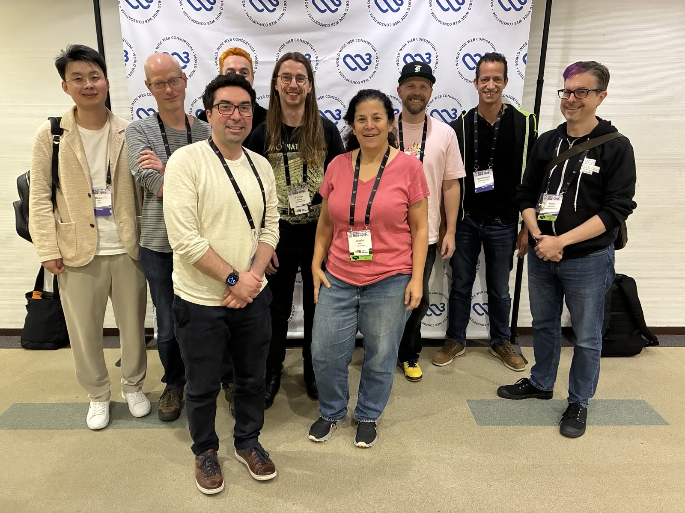

## Executive summary

Open Web Docs' work in 2025 helped ensure the long-term health of web platform documentation on critical resources like MDN Web Docs, independently of any single vendor or organization. Founded in January 2021, 2025 marked Open Web Docs’ fifth year of operation!

Open Web Docs (OWD) is an [Open Source Collective](https://opencollective.com/open-web-docs) that employs engineers to publicly document open web technologies. The team at OWD has extensive experience with Web standards documentation, MDN Web Docs, and browser compatibility data. We write new documentation, update existing documentation, and improve documentation infrastructure. Open Web Docs works together with other organizations such as Mozilla, Google, Microsoft, W3C, Igalia, as well as the [Sovereign Tech Agency](https://openwebdocs.org/content/posts/stf-investment-2025/), and other external contributors and volunteers.

In 2025, Open Web Docs:

- Was again the organization that contributed the greatest number of pull requests (PRs) merged to the [mdn/content](https://github.com/mdn/content) (10.0%) and [mdn/browser-compat-data](https://github.com/mdn/browser-compat-data) (27.2%) repositories.
- Provided 14.25% of all pull request reviews to the mdn/content repository and 27.29% of reviews to mdn/browser-compat-data.
- Completed major technical writing and documentation engineering projects. This included among other things:
  - [Collecting browser compatibility data for every browser release, including all beta releases](#collecting-browser-compatibility-data-whenever-browsers-release-a-new-beta-version)
  - [Web Security documentation](#web-security-documentation)
  - CSS docs

Previous Open Web Docs Impact and Transparency Reports:
[2024](https://openwebdocs.org/content/reports/2024/), [2023](https://openwebdocs.org/content/reports/2023/), [2022](https://openwebdocs.org/content/reports/2022/), [2021](https://openwebdocs.org/content/reports/2021/).

Open Web Docs is a non-profit, strongly community-focused open source collective that uses its donations to employ a group of technical writers who are dedicated to writing and improving documentation for the web platform.

Donate today:

- [GitHub Sponsors](https://github.com/sponsors/openwebdocs)
- [Open Collective](https://opencollective.com/open-web-docs)

Tell your company to support us with a membership!
As a [member organization](https://openwebdocs.org/membership) you are entitled to further benefits in addition to supporting core web platform documentation and engineering. Reach out to [florian@openwebdocs.org](mailto:florian@openwebdocs.org) for more information.

## OWD maintainership by the numbers

In 2025, Open Web Docs continued to maintain and improve the following four essential web platform documentation ecosystem projects:

- [mdn/content](https://github.com/mdn/content)
- [mdn/browser-compat-data](https://github.com/mdn/browser-compat-data)
- [openwebdocs/mdn-bcd-collector](https://github.com/openwebdocs/mdn-bcd-collector)
- [web-platform-dx/web-features](https://github.com/web-platform-dx/web-features)

Open web standards documentation needs ongoing updating and maintenance as new web platform features are introduced and best practices change. At OWD, we believe the above projects are essential sources of information web developers consult and trust and that by contributing to these repositories, we can reach the majority of web developers worldwide with comprehensive, accurate and informative documentation about the open web platform.

[Git Pulse rankings](https://git-pulse.github.io/snapshots/) help put our work in perspective in the overall open-source ecosystem. In 2025, the mdn/content repository is again in the top 10 of all of the repositories hosted on GitHub!

### Pull requests authored

Since our launch in 2021, Open Web Docs has been the primary organizational contributor to the mdn/content and the mdn/browser-compat-data repositories. Here's the summary of merged PRs authored (excluding bots):

| Project                 | Total authored PRs | OWD authored PRs |
| ----------------------- | ------------------ | ---------------- |
| mdn/content             | 3158               | 316 (10.0%)      |
| mdn/browser-compat-data | 1117               | 304 (27.2%)      |

2025 is the second year in which [Joshua Chen](https://github.com/Josh-Cena) deserves a special shout out. 400 PRs authored by Josh were merged to mdn/content in 2025.

### Pull requests reviewed

As in previous years, there's a very long tail of contributors and a thriving community actively involved with our work. For mdn/content, we group all contributors into three categories: one-timers, casual contributors (2-9 PRs) and core contributors (10+ PRs). The 2025 breakdown looks like this:

- 558 one-time contributors with 1 PR merged.
- 132 casual contributors with 2-9 PRs merged.
- 33 core contributors with 10 or more PRs merged.

Supporting this long tail of volunteers is a large part of OWD's work. PR reviews for the mdn/content repository are performed by members of the maintainer group, which consists of OWD, Mozilla, Google, Microsoft, and W3C staff, and a select group of volunteer maintainers.

Here's the summary of reviewed PRs:

| Project                 | Total reviewed PRs | OWD reviewed PRs |
| ----------------------- | ------------------ | ---------------- |
| mdn/content             | 3761               | 536 (14.25%)     |
| mdn/browser-compat-data | 1704               | 465 (27.29%)     |

## OWD project work

The Open Web Docs is guided by the [OWD prioritization criteria](https://github.com/openwebdocs/project/blob/main/steering-committee/prioritization-criteria.md) and [OWD’s charter](https://github.com/openwebdocs/project/blob/main/charter.md). OWD efforts are prioritized based on the needs of the global community of web developers and designers. The [OWD project proposal](https://github.com/openwebdocs/project/issues/new/choose) process is open to everyone, with proposals reviewed by the OWD staff team and Governing Committee.

Major projects Open Web Docs took on in 2025 are:

### Collecting browser compatibility data whenever browsers release a new beta version

This BCD automation project's mission is to provide web developers with the latest information about available web platform features whenever a new browser version is released. The project was initially funded by the Sovereign Tech Fund and continued thanks to the support of OWD's main sponsors Google and Microsoft. In 2025, we systematically collected compatibility data 28 times; we observed 12 releases from Chrome (applying to Edge too), 13 from Firefox, and 3 from Safari.

For Chrome 133-144, Firefox 135-147, and Safari 18.4, 26 and 26.2, we were able to update browser compatibility data within the beta cycles of each browser release. This enabled us to provide web developers with updated information at the time the stable browser version was released.

2025 was the second full year we systematically collected web platform compatibility data. We want to continue this effort and make it as timely and efficient as possible for every browser release for all the years to come. The maintenance of the mdn-browser-compat-data project benefits greatly from these efforts, and the data is accurate, reliable, and complete, which allows the consumers of the data, especially MDN, web-features, and the Baseline projects, to be up-to-date and accurate.

The BCD automation project is led by [Florian Scholz](https://github.com/Elchi3) and representatives of browser projects have been reviewing data. Thank you: [Rachel Andrew](https://github.com/rachelandrew) (Chromium/Google), [Chris Mills](https://github.com/chrisdavidmills) (Chromium/Google), [Patrick Brosset](https://github.com/captainbrosset/) (Chromium/Microsoft), [Jon Davis](https://github.com/jdatapple) (WebKit/Apple), [Jen Simmons](https://github.com/jensimmons) (WebKit/Apple), [Ruth John](https://github.com/Rumyra) (Gecko/Mozilla), [Brian Smith](https://github.com/bsmth) (Gecko/Mozilla), [Hamish Willee](https://github.com/hamishwillee) (Gecko/Mozilla).

A special shout out to [Claas Augner](https://github.com/caugner) (Gecko/Mozilla) who has been taking on a leading role in reviewing PRs and advancing the BCD project in 2025.

### Web Security documentation

In 2024 we started a long-term project to improve and extend web security documentation on MDN. We've received funding from the [Sovereign Tech Fund](https://www.sovereign.tech/tech/open-web-docs-2025) to continue this work in 2025 and into 2026.

#### Attacks

Initially the main focus of our web security documentation project was continuing and concluding our series of guides on [web security attacks](https://developer.mozilla.org/en-US/docs/Web/Security/Attacks). Our aim here is to help developers understand:

- The conditions under which their sites are vulnerable to specific attacks
- The impact of these attacks
- Recommended practices to defend against them

Our guiding principles in writing these guides are to make them _accessible_, _practical_, and _up to date_.

We've written guides on the attacks most likely to be faced by web developers today, including [cross-site leaks](https://developer.mozilla.org/en-US/docs/Web/Security/Attacks/XS-Leaks), [cross-site request forgery](https://developer.mozilla.org/en-US/docs/Web/Security/Attacks/CSRF), [prototype pollution](https://developer.mozilla.org/en-US/docs/Web/Security/Attacks/Prototype_pollution), and [supply chain attacks](https://developer.mozilla.org/en-US/docs/Web/Security/Attacks/Supply_chain_attacks). We've included modern defenses such as [trusted types](https://developer.mozilla.org/en-US/docs/Web/API/Trusted_Types_API) and [fetch metadata](https://developer.mozilla.org/en-US/docs/Glossary/Fetch_metadata_request_header) alongside more traditional methods. We've included clear guidance about which defenses are essential and which can add defense in depth.

TBD include testmonials from Aaron and/or link to https://bughunters.google.com/blog/effortless-web-security-secure-by-design-in-the-wild

### Authentication

From September 2025 we've moved on to the next stage of this project, writing documentation for web developers who need to authenticate users on their sites. Authentication is probably the most common target for attacks, so it's a core component of the web security project.

The main part of this work is a series of articles on the four main authentication methods available to web developers. In 2025 we published guides to three of these: [passwords](https://developer.mozilla.org/en-US/docs/Web/Security/Authentication/Passwords), [one-time codes](https://developer.mozilla.org/en-US/docs/Web/Security/Authentication/OTP), [federated identity](https://developer.mozilla.org/en-US/docs/Web/Security/Authentication/Federated_identity), and drafted the fourth guide, on [passkeys](https://github.com/mdn/content/pull/42338).

Each guide explains how the method works, walking through the main flows involved, highlights potential vulnerabilities and outlines recommended practices.

### CSS documentation

TBD Estelle

## Project Economics: Finding a Sustainable Future for Web Platform Documentation

Open Web Doc's budget is openly shared with the community on the Open Collective Platform. While this makes our transactions viewable, it does not readily convey the challenges we face when it comes to long-term project sustainability. Memberships, grants, one-time sponsorships, and recurring donations are forecasted against known expenses; sustainability requires balancing this revenue and risk. 2025 was again a challenging year for open source sustainability across the tech industry, and OWD was not an exception: the OWD Governing Committee made the difficult decision to part with a cherished part-time team member. This allowed the project to rebalance risk and ensure OWD could make it into the next funding cycle.

To further reduce risk, OWD is working to diversify its funding sources. Membership revenue accounts for the greatest source of financial support. In 2025, OWD was very grateful to have the support of Platinum Members Google and Microsoft, Gold Member Igalia, and Silver Member Bloomberg. Additionally, the Sovereign Tech Fund committed a total of 220,000€ to Open Web Docs to help web developers to secure their sites by documenting Web Security and Privacy topics. This investment continues in 2026.

Payroll is Open Web Docs’ only meaningful expense. We pay competitive salaries in our staff's local currency, and receive health care, retirement, and other regionally compliant benefits. In 2025, OWD spent a total of $XXX,XXX on payroll expenses, inclusive of contractors, taxes, wire fees, exchange fees and payroll services. Minor operating expenses ($XXk) and transaction fees on collective revenue ($XXk) account for the balance of OWD expenses. We post all transactions on our [Open Collective](https://opencollective.com/open-web-docs) page.

### 2026 Financial Forecast

We have forecasted a total of $450,000 which consists of commitments from our Platinum and Gold Members Microsoft and Igalia, an investment from the Sovereign Tech Agency, and an anticipated $10,000 in community donations from Open Collective and GitHub Sponsors. While our forecasted expenses are down from 2025 to $600,000 OWD is forecasting a budget deficit.

We're working on closing this $140,000 gap with additional grant applications, special project funding, and new Member support. Becoming a supporting member of Open Web Docs offers benefits in addition to supporting core web platform documentation and engineering. **If your organization would be interested in helping us close this short deficit by becoming a Member or making a one-time donation, please email [florian@openwebdocs.org](mailto:florian@openwebdocs.org).**

## Gratitude for our Individual Supporters in 2025

Thank you to each and everyone who supports us with recurring or one-time donations! Your sponsorship means the world to us!

### Individual supporters

Huge thanks to all the individuals who support us with a recurring monthly donation of $10 or more via [Open Collective](https://opencollective.com/open-web-docs#category-CONTRIBUTE)!

<object type="image/svg+xml" data="https://opencollective.com/open-web-docs/tiers/monthly-supporter.svg?avatarHeight=80&width=480"></object>

### Individual backers

Also thanks to the many backers who support us with a recurring donation of $5 or more every month!

<object type="image/svg+xml" data="https://opencollective.com/open-web-docs/tiers/backer.svg?avatarHeight=80&width=480"></object>

### GitHub Sponsors

And of course, thank you to all of Open Web Docs' [GitHub Sponsors](https://github.com/sponsors/openwebdocs)!

  <iframe
    src="https://github.com/sponsors/openwebdocs/card"
    title="Sponsor openwebdocs"
    height="225"
    width="500"
    style="border: 0"
  ></iframe>

## Looking forward to 2026

We’re inviting all of our partners and backers for another year of supporting web platform documentation for the benefit of web developers & designers worldwide. We aim to continue with our [mission](https://github.com/openwebdocs/project/blob/main/charter.md) and foster collaborations with existing initiatives to improve the general developer experience for people developing for the web. We consider web platform docs critical digital infrastructure, and we work cooperatively to ensure its long-term health.

We are funded by corporate and individual donations. If your organization or project is interested in advancing open web platform documentation, we would love to hear from you! Please reach out to [florian@openwebdocs.org](mailto:florian@openwebdocs.org).

_Open Web Docs in Kōbe, Japan for W3C TPAC. November 2025._
